<div align="center">
    
    <br/><b><i>Vietnam General Confederation of Labor</i></b><br/>
    <h2><b><i>TON DUC THANG UNIVERSITY</i></b></h2>
    <h3><i>Faculty of Information Technology</i></h3>
    <h4>***</h4>
    <br/>
</div>

<div align="center">
    
    <h1><b>Music App</b></h1>
    <h5><i>Music App is a web application that everyone can access to find and listen to music online. Moreover, people can upload their song and download their favorite song.</i></br>***</h5>
    </br>
</div>

# Table of contents

1. [About](#1-about)</br>
2. [Requirements](#2-requirements)</br>
3. [Install](#3-install)</br>
4. [Design Pattern](#4-design-pattern)</br>
    4.1 [Factory Method Pattern](#factory-method-pattern)</br>
    - [Giới thiệu](#giới-thiệu-factory-method-pattern)
    - [Lý do áp dụng](#lý-do-áp-dụng-factory-method-pattern)
    - [Mô tả việc áp dụng](#mô-tả-việc-áp-dụng-factory-method-pattern)
    - [Áp dụng](#áp-dụng-factory-method-pattern)
    - [Testcase](#testcase-factory-method-pattern)

    4.2 [Template Method Pattern](#template-method-pattern)</br>
    - [Giới thiệu](#giới-thiệu-template-method-pattern)
    - [Lý do áp dụng](#lý-do-áp-dụng-template-method-pattern)
    - [Mô tả việc áp dụng](#mô-tả-việc-áp-dụng-template-method-pattern)
    - [Áp dụng](#áp-dụng-template-method-pattern)
    - [Testcase](#testcase-template-method-pattern)

    4.3 [Adapter Pattern](#adapter-pattern)</br>
    - [Giới thiệu](#giới-thiệu-adapter-pattern)
    - [Lý do áp dụng](#lý-do-áp-dụng-adapter-pattern)
    - [Mô tả việc áp dụng](#mô-tả-việc-áp-dụng-adapter-pattern)
    - [Áp dụng](#áp-dụng-adapter-pattern)
    - [Testcase](#testcase-adapter-pattern)

    4.4 [Singleton Pattern](#singleton-pattern)</br>
    - [Giới thiệu](#giới-thiệu-singleton-pattern)
    - [Lý do áp dụng](#lý-do-áp-dụng-singleton-pattern)
    - [Mô tả việc áp dụng](#mô-tả-việc-áp-dụng-singleton-pattern)
    - [Áp dụng](#áp-dụng-singleton-pattern)
    - [Testcase](#testcase-singleton-pattern)

    4.5 [MVC Pattern](#mvc-pattern)</br>
    - [Giới thiệu](#giới-thiệu-mvc-pattern)
    - [Lý do áp dụng](#lý-do-áp-dụng-mvc-pattern)
    - [Mô tả việc áp dụng](#mô-tả-việc-áp-dụng-mvc-pattern)
    - [Áp dụng](#áp-dụng-mvc-pattern)
    - [Testcase](#testcase-mvc-pattern)

    4.6 [Observer Pattern](#observer-pattern)</br>
    - [Giới thiệu](#giới-thiệu-observer-pattern)
    - [Lý do áp dụng](#lý-do-áp-dụng-observer-pattern)
    - [Mô tả việc áp dụng](#mô-tả-việc-áp-dụng-observer-pattern)
    - [Áp dụng](#áp-dụng-observer-pattern)
    - [Testcase](#testcase-observer-pattern)
5. [Some pictures](#5-some-pictures)
    

</br>

# 1. About

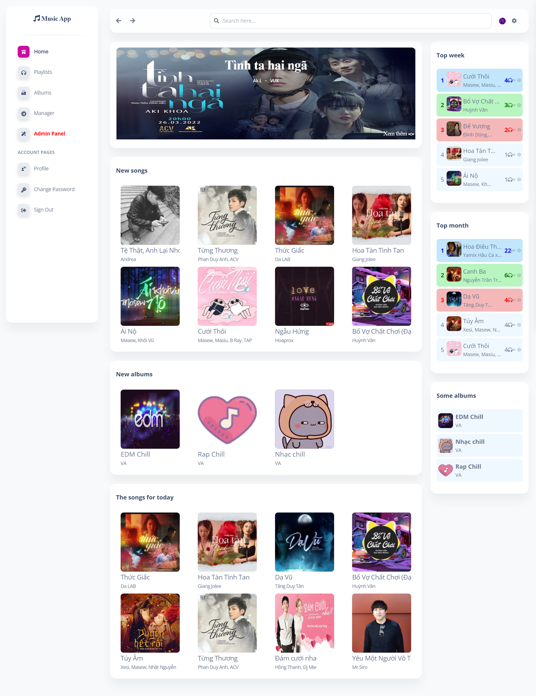
</br>

**Author**

<ul>
    <li>Nguyễn Phú Quí - 51900192</li>
    <li>Nguyễn Quốc Thái - 51900210</li>
</ul>

**Technicality**

<ul>
    <li>Languages: <code>DOT.NET CORE RESTful API Server + ReactJS Client</code></li>
    <li>Database: <code>MySQL</code></li>
</ul>

**Features**

- Users:
    - Signin and signup account
    - Reset and change account password
    - Change account infomation
    - Upload new songs
    - Create song drafts
    - Create new albums
    - Manage songs, drafts, albums
        - Hide/Show
        - Update
        - Delete
    - Listen songs
    - Download a song
    - Add songs to playlist
    - Control music player
    - Realtime chat together
- Administrator:
    - Confirm song requests
    - Refuse song requests
    - Create
        - New albums
        - New category
        - New songs
        - New banners
    - Update / Delete
        - Song requests
        - Songs
        - Albums
        - Categories
        - Banners
        - Users
    - Hide / Show
        - Songs
        - Albums
        - Categories
        - Banners
    - Crawl songs from other website
        - nhaccuatui.com
        - nhac.vn
        - chiasenhac.vn
        - keeng.vn
    - Create and download database backup

**Usecase**

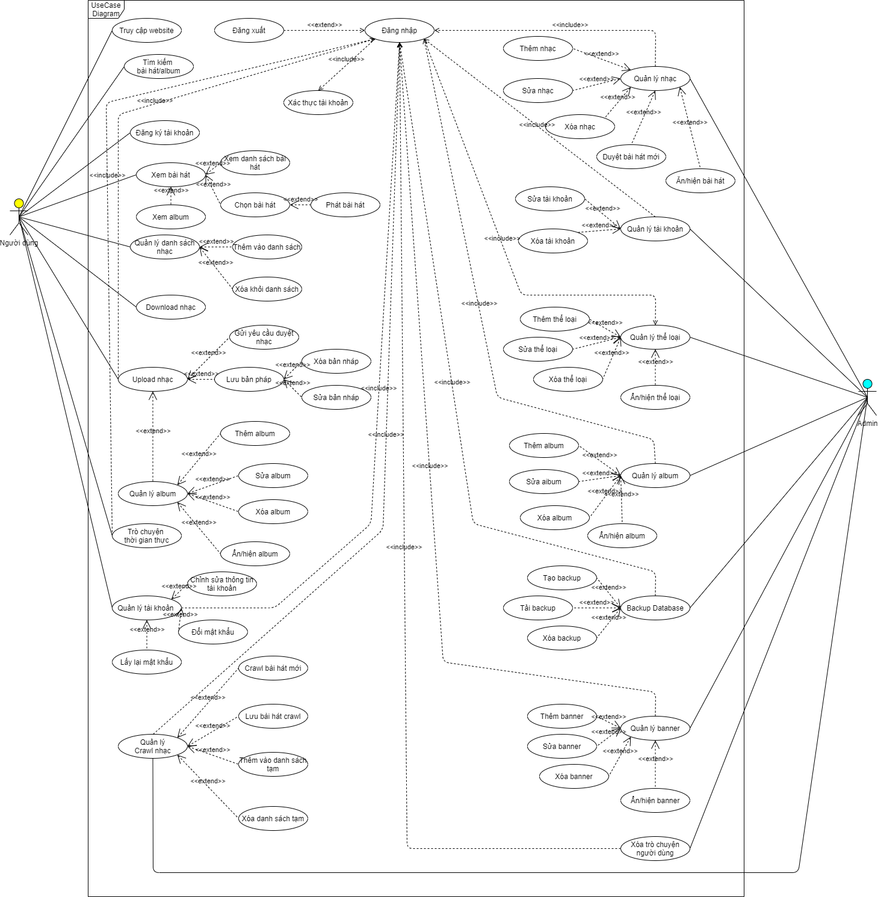

**Database Class Diagram**

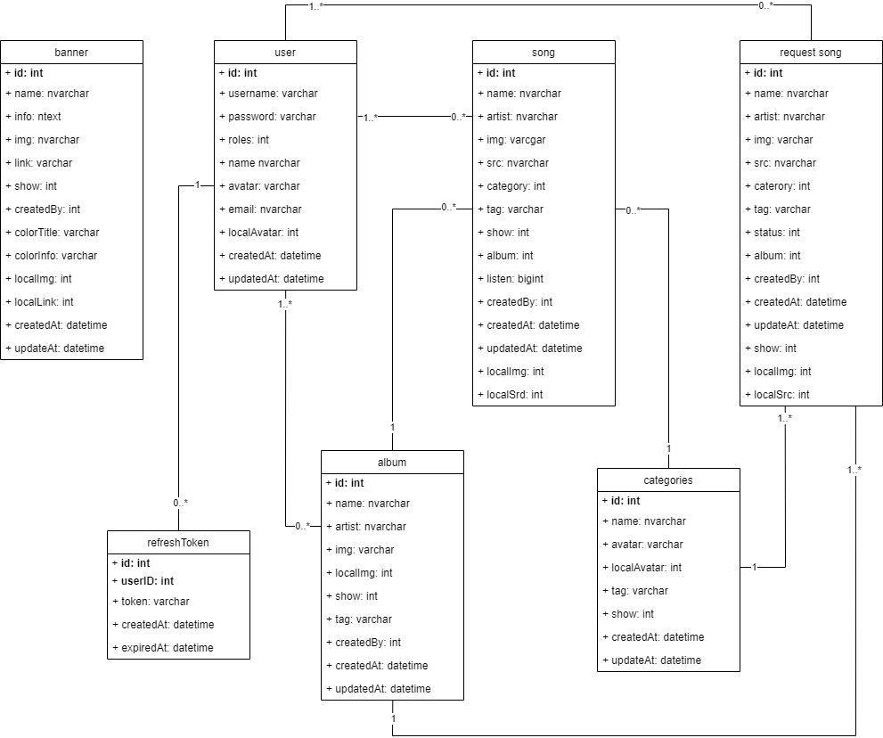

# 2. Requirements

<ul>
<li>DOT.NET CORE</li>
<li>ReactJS, NodeJS</li>
<li>MySQL Server</li>
</ul>

# 3. Install

<ul>
<li>Clone the repository with git clone </li>
<li>Run <code>SQLQuery.sql</code> in MySQL if you want to new database or use <code>backupDatabase.bak</code> file for database backuped in MySQL with <code>Music</code> database</li>
<li>Config server database in <code>server/server/Models/MusicContext.cs</code> file at line <code>33</code></li>
<li>Open <code>server</code> folder in <code>Visual Studio</code> and run it</li>
<li>Config client in <code>client/.env</code> file.</li>
<li>Run <code>npm install</code> to install dependencies and <code>npm start</code> in <code>client</code> folder. You can run this command in <code>Window Command Prompt</code> or <code>VSCode</code></li>
<li>Your demo is available at <code>localhost:3000</code></li>
</ul>

# 4. Design Pattern

## Factory Method Pattern

### Giới thiệu Factory Method Pattern

>Factory Method Design Pattern hay gọi ngắn gọn là Factory Pattern là một trong những Pattern thuộc nhóm Creational Design Pattern. Nhiệm vụ của Factory Pattern là quản lý và trả về các đối tượng theo yêu cầu, giúp cho việc khởi tạo đổi tượng một cách linh hoạt hơn.

### Lý do áp dụng Factory Method Pattern

- Trường hợp áp dụng: áp dụng vào việc crawl nhạc từ các trang bên ngoài như nhaccuatui, keeng,... ở phía server
- Lý do áp dụng:
    - Việc crawl nhạc từ các trang khác nhau nhaccuatui, keeng
    - Thuật toán xử lý việc crawl dữ liệu nhạc khác nhau ở mỗi trang
    - Đều trả về chung một kết quả là dữ liệu một bài hát crawl được
    - Đều nhận vào một url là đường dẫn đến bài hát đó
- Ưu điểm sau khi áp dụng
    - Tối ưu code (rút gọn code)
    - Có thể dễ dàng mở rộng tool crawl cho nhiều trang web khác nhau
    - Dễ dàng bảo trì cũng như chỉnh sửa hoạt động của tool khi trang web crawl thay đổi cấu trúc dữ liệu

### Mô tả việc áp dụng Factory Method Pattern

- Class diagram:

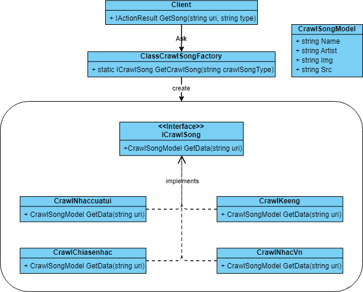

- Trong đó:
    - `ICrawSong`: (Super Class) là một interface định nghĩa phương thức cần thiết của Factory
    - `CrawlNhaccuatui`, `CrawlKeeng`, `CrawlNhacVn`, `CrawlChiasenhac`: (Sub Class) là các class được implement *Super Class*, trong đó sẽ override lại phương thức cửa *super class* và chứa thuật toán crawl nhạc
    - `CrawlSòngactory`: là lớp chịu trách nhiệm khởi tạo các *sub class* dựa trên đầu vào
    - `CrawlSongModel`: là lớp chịu trách nhiệm định nghĩa các dữ liệu cho mỗi object bài hát

### Áp dụng Factory Method Pattern

- **Trước khi áp dụng**

<code>AdminToolController.cs</code>

```cs
[HttpGet("{type}")]
public IActionResult GetSong(string uri, string type)
{
    if(uri == null || type == null || uri.Trim().Length == 0 || type.Trim().Length == 0)
    {
        return BadRequest(new
        {
            success = false,
            message = "Enter link or type!",
        });
    }

    try
    {
        if(type.Equals("nhaccuatui")){
            var curl = CurlHelper.Get(uri);
            var matchs = Regex.Matches(curl, "xmlURL = \"(.+?)\";");
            var link = matchs[0].Groups[1].Value;
            curl = CurlHelper.Get(link);
            matchs = Regex.Matches(curl, @"<!\[CDATA\[(.+?)]]>");
            string name = matchs[0].Groups[1].Value;
            string artist = matchs[2].Groups[1].Value;
            string src = matchs[3].Groups[1].Value;
            matchs = Regex.Matches(curl, @"<avatar><!\[CDATA\[(.+?)]]>");
            string img = matchs[0].Groups[1].Value;
            return Ok(new CrawlSongModel()
            {
                Name = name,
                Artist = artist,
                Src = src,
                Img = img,
            });
        }else if(type.Equals("nhacvn")){
                var curl = CurlHelper.Get(uri);
                var matchs = Regex.Matches(curl, "sources: \\[\\{\"file\":\"(.+?)\",");
                var src = matchs[0].Groups[1].Value.Replace("\\", "");
                matchs = Regex.Matches(curl, "title:'(.+?)',");
                var name = matchs[0].Groups[1].Value;
                matchs = Regex.Matches(curl, "thumb : '(.+?)',");
                var img = matchs[0].Groups[1].Value;
                matchs = Regex.Matches(curl, "description:'(.+?)',");
                var artist = matchs[0].Groups[1].Value;
                return Ok(new CrawlSongModel()
                {
                    Name = name,
                    Artist = artist,
                    Src = src,
                    Img = img,
                });
        }else{
            return BadRequest(new
            {
                success = false,
                message = "Type can not found!"
            });
        }
    }
    catch (Exception)
    {
        return BadRequest(new
        {
            success = false,
            message = "Not found song, check your link!"
        });
    }
}
```

</br>

- **Sau khi áp dụng**

<code>AdminToolController.cs</code>

```cs
[HttpGet("{type}")]
public IActionResult GetSong(string uri, string type)
{
    if(uri == null || type == null || uri.Trim().Length == 0 || type.Trim().Length == 0)
    {
        return BadRequest(new
        {
            success = false,
            message = "Enter link or type!",
        });
    }

    try
    {
        ICrawlSong crawl = CrawlSongFactory.GetCrawlSong(type);
        return Ok(crawl.GetData(uri));
    }
    catch (Exception)
    {
        return BadRequest(new
        {
            success = false,
            message = "Not found song, check your link!"
        });
    }
}
```

<code>ICrawlSong.cs</code>

```cs
public interface ICrawlSong
{
    public CrawlSongModel GetData(string uri);
}
```

<code>CrawlSongFactory.cs</code>

```cs
public class CrawlSongFactory
{
    private CrawlSongFactory() { }
    public static ICrawlSong GetCrawlSong(string crawlSongType)
    {
        switch (crawlSongType.Trim().ToLower())
        {
            case "nhaccuatui":
                return new CrawlNhaccuatui();
            case "nhacvn":
                return new CrawlNhacVn();
            case "chiasenhac":
                return new CrawlChiasenhac();
            case "keeng":
                return new CrawlKeeng();
            default:
                throw new ArgumentException("This type is unsupported");
        }
    }
}
```

<code>CrawlSongModel.cs</code>

```cs
public class CrawlSongModel
{
    public string Name { get; set; }
    public string Artist { get; set; }
    public string Img { get; set; }
    public string Src { get; set; }
}
```

<code>CrawlNhaccuatui.cs</code>

```cs
public class CrawlNhaccuatui : ICrawlSong
{
    public CrawlSongModel GetData(string uri)
    {
        try
        {
            var curl = CurlHelper.Get(uri);
            var matchs = Regex.Matches(curl, "xmlURL = \"(.+?)\";");
            var link = matchs[0].Groups[1].Value;
            curl = CurlHelper.Get(link);
            matchs = Regex.Matches(curl, @"<!\[CDATA\[(.+?)]]>");
            string name = matchs[0].Groups[1].Value;
            string artist = matchs[2].Groups[1].Value;
            string src = matchs[3].Groups[1].Value;
            matchs = Regex.Matches(curl, @"<avatar><!\[CDATA\[(.+?)]]>");
            string img = matchs[0].Groups[1].Value;
            return new CrawlSongModel()
            {
                Name = name,
                Artist = artist,
                Src = src,
                Img = img,
            };
        }
        catch
        {
            throw new Exception();
        }
    }
}
```

<code>CrawlNhacVn.cs</code>

```cs
public class CrawlNhacVn : ICrawlSong
{
    public CrawlSongModel GetData(string uri)
    {
        try
        {
            var curl = CurlHelper.Get(uri);
            var matchs = Regex.Matches(curl, "sources: \\[\\{\"file\":\"(.+?)\",");
            var src = matchs[0].Groups[1].Value.Replace("\\", "");
            matchs = Regex.Matches(curl, "title:'(.+?)',");
            var name = matchs[0].Groups[1].Value;
            matchs = Regex.Matches(curl, "thumb : '(.+?)',");
            var img = matchs[0].Groups[1].Value;
            matchs = Regex.Matches(curl, "description:'(.+?)',");
            var artist = matchs[0].Groups[1].Value;
            return new CrawlSongModel()
            {
                Name = name,
                Artist = artist,
                Src = src,
                Img = img,
            };
        }
        catch
        {
            throw new Exception();
        }
    }
}
```

### Testcase Factory Method Pattern

- **Testcase 01:**
    - Input:
        - Base url: `https://localhost:44315/api/admin/tool/`
        - Params:
            - uri = `https://www.nhaccuatui.com/bai-hat/sao-tiec-nguoi-khong-tot-hoai-lam-ft-vuong-anh-tu.ZktipDfnuj16.html`
            - type = `nhaccuatui`
    - Output:

```json
{
  "name": "Sao Tiếc Người Không Tốt",
  "artist": "Hoài Lâm, Vương Anh Tú",
  "img": "https://avatar-ex-swe.nixcdn.com/song/2022/04/15/b/a/6/c/1649986538375.jpg",
  "src": "https://f9-stream.nixcdn.com/NhacCuaTui1026/SaoTiecNguoiKhongTot-HoaiLamVuongAnhTu-7187294.mp3?st=7hMjDHu0CSn53lkSbWSvHQ&e=1652879061"
}
```


- **Testcase 02:**
    - Input:
        - Base url: `https://localhost:44315/api/admin/tool/`
        - Params:
            - uri = `https://www.nhaccuatui.com/bai-hat/sao-tiec-nguoi-khong-tot-hoai-lam-ft-vuong-anh-tu.ZktipDfnuj16.html`
            - type = `nhacvn`
    - Output:

```json
{
  "success": false,
  "message": "Not found song, check your link!"
}
```


- **Testcase 03:**
    - Input:
        - Base url: `https://localhost:44315/api/admin/tool/`
        - Params:
            - uri = `https://nhac.vn/bai-hat/nguoi-khac-phan-manh-quynh-soQJlxj`
            - type = `nhacvn`
    - Output:

```json
{
  "name": "Người Khác",
  "artist": "Phan Mạnh Quỳnh",
  "img": "https://109cdf7de.vws.vegacdn.vn/kv0puCNE4oNNfn7YhOpK/1512982509/v1/album/s2/0/20/796/21787229.jpg?v=1512982509",
  "src": "https://109a15170.vws.vegacdn.vn/ZBoIGwn6mgsckkRNpVtf4A/1652836411/media2/song/web1/172/1411800/1411800.mp3?v=3"
}
```


</br>

## Template Method Pattern

### Giới thiệu Template Method Pattern

>Template Method Pattern là một trong những Pattern thuộc nhóm hành vi (Behavior Pattern). Pattern này nói rằng “Định nghĩa một bộ khung của một thuật toán trong một chức năng, chuyển giao việc thực hiện nó cho các lớp con. Mẫu Template Method cho phép lớp con định nghĩa lại cách thực hiện của một thuật toán, mà không phải thay đổi cấu trúc thuật toán“.

### Lý do áp dụng Template Method Pattern

- Trường hợp áp dụng: áp dụng vào việc lưu file upload ở phía server
- Lý do áp dụng:
    - File upload có nhiều dạng file nên được chia ra các thư mục lưu khác nhau
    - Các bước lưu file giống nhau
    - Việc lưu file có các thuật toán chung chỉ khác ở đường dẫn lưu với các file khác nhau
    - Đều trả về chung một kết quả là tên hoặc đường dẫn file đã lưu trên server
    - Đều nhận vào một file
- Ưu điểm sau khi áp dụng
    - Tối ưu code (rút gọn code)
    - Có thể dễ dàng thay đổi thuật toán lưu file
    - Dễ dàng bảo trì cũng như chỉnh sửa đường dẫn lưu file mà không cần quan tâm đã sử dụng ở dâu (chỉnh một lần, apply cho tất cả)
    - Không cần ghi nhớ đường dẫn lưu file mối khi sử dụng. Hạn chế lỗi về sai sót trong đường dẫn lưu file

### Mô tả việc áp dụng Template Method Pattern

- Class diagram:

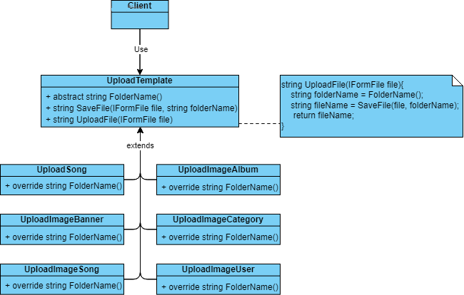

- Trong đó:
    - `UploadTemplate`: (Abtract Class) là một abtract định nghĩa phương thức cần thiết, các thuật toán chung và các bước thực hiện thuật toán
    - `UploadImageSong`, `UploadImageAlbum`, `UploadImageBanner`, `UploadImageCategory`, `UploadImageUser`, `UploadSong`: (Sub Class) là các class được extends *Abtract Class*, trong đó sẽ viết các thuật toán cho các phương thức abtract cửa *super class*

### Áp dụng Template Method Pattern

- **Trước khi áp dụng**

<code>AdminSongController.cs</code> > <code>CreateSong()</code>

```cs
[HttpPost("create"), DisableRequestSizeLimit]
public async Task<IActionResult> CreateSong()
{
    var createBy = User.Identity.GetId();
    try
    {
        // ...Some code get data... //
                
        if (localImg == 1 && localSrc == 0)
        {

            var folderName = Path.Combine("Uploads", "Images", "Songs");

            var pathToSave = Path.Combine(Directory.GetCurrentDirectory(), folderName);
            var fileName = SongHelper.ConvertSongFile(ContentDispositionHeaderValue.Parse(files[0].ContentDisposition).FileName.Trim('"'));
            var fullPath = Path.Combine(pathToSave, fileName);
            using (var stream = new FileStream(fullPath, FileMode.Create))
            {
                files[0].CopyTo(stream);
            }

            src = formCollection["src"][0].ToString().Trim();
            image = fileName;
        }
        if (localImg == 0 && localSrc == 1)
        {
            var folderName = Path.Combine("Uploads", "Songs");

            var pathToSave = Path.Combine(Directory.GetCurrentDirectory(), folderName);
            var fileName = SongHelper.ConvertSongFile(ContentDispositionHeaderValue.Parse(files[0].ContentDisposition).FileName.Trim('"'));
            var fullPath = Path.Combine(pathToSave, fileName);
            using (var stream = new FileStream(fullPath, FileMode.Create))
            {
                files[0].CopyTo(stream);
            }
            image = formCollection["img"][0].ToString().Trim();
            src = fileName;
        }
        if (localImg == 1 && localSrc == 1)
        {
            var folderName = Path.Combine("Uploads", "Songs");

            var pathToSave = Path.Combine(Directory.GetCurrentDirectory(), folderName);
            var fileName = SongHelper.ConvertSongFile(ContentDispositionHeaderValue.Parse(files[0].ContentDisposition).FileName.Trim('"'));
            var fullPath = Path.Combine(pathToSave, fileName);
            using (var stream = new FileStream(fullPath, FileMode.Create))
            {
                files[0].CopyTo(stream);
            }
            src = fileName;

            folderName = Path.Combine("Uploads", "Images", "Songs");

            pathToSave = Path.Combine(Directory.GetCurrentDirectory(), folderName);
            fileName = SongHelper.ConvertSongFile(ContentDispositionHeaderValue.Parse(files[1].ContentDisposition).FileName.Trim('"'));
            fullPath = Path.Combine(pathToSave, fileName);
            using (var stream = new FileStream(fullPath, FileMode.Create))
            {
                files[1].CopyTo(stream);
            }

            image = fileName;
        }
        if(localImg == 0 && localSrc == 0)
        {
            image = formCollection["img"][0].ToString().Trim();
            src = formCollection["src"][0].ToString().Trim();
        }

        // ...some code create and return data... //
                  
    }
    catch (Exception e)
    {
        return StatusCode(500, "Internal server error " + e);
    }
}
```

</br>

- **Sau khi áp dụng**

<code>AdminSongController.cs</code> > <code>CreateSong()</code>

```cs
[HttpPost("create"), DisableRequestSizeLimit]
public async Task<IActionResult> CreateSong()
{
    var createBy = User.Identity.GetId();
    try
    {
        // ...Some code get data... //
                
        UploadTemplate upload;
        if (localImg == 1 && localSrc == 0)
        {
            src = formCollection["src"][0].ToString().Trim();
            upload = new UploadImageSong();
            image = upload.UploadFile(files[0]);
        }
        if (localImg == 0 && localSrc == 1)
        {
            image = formCollection["img"][0].ToString().Trim();
            upload = new UploadSong();
            src = upload.UploadFile(files[0]);
        }
        if (localImg == 1 && localSrc == 1)
        {
            upload = new UploadImageSong();
            image = upload.UploadFile(files[0]);
            upload = new UploadSong();
            src = upload.UploadFile(files[1]);
        }
        if(localImg == 0 && localSrc == 0)
        {
            image = formCollection["img"][0].ToString().Trim();
            src = formCollection["src"][0].ToString().Trim();
        }

        // ...some code create and return data... //
                  
    }
    catch (Exception e)
    {
        return StatusCode(500, "Internal server error " + e);
    }
}
```

<code>UploadTemplate.cs</code>

```cs
public abstract class UploadTemplate
{
    protected abstract string FolderName();
    protected string SaveFile(IFormFile file, string folderName)
    {
        var pathToSave = Path.Combine(Directory.GetCurrentDirectory(), folderName);
        var fileName = SongHelper.ConvertSongFile(ContentDispositionHeaderValue.Parse(file.ContentDisposition).FileName.Trim('"'));
        var fullPath = Path.Combine(pathToSave, fileName);
        using (var stream = new FileStream(fullPath, FileMode.Create))
        {
            file.CopyTo(stream);
        }
        return fileName;
    }
    public string UploadFile(IFormFile file)
    {
        string folderName = FolderName();
        string fileName = SaveFile(file, folderName);
        return fileName;  
    }
}
```

<code>UploadSong.cs</code>

```cs
public class UploadSong : UploadTemplate
{
    protected override string FolderName()
    {
        return Path.Combine("Uploads", "Songs");
    }
}
```

<code>UploadImageSong.cs</code>

```cs
public class UploadImageSong : UploadTemplate
{
    protected override string FolderName()
    {
        return Path.Combine("Uploads", "Images", "Songs");
    }
}
```

<code>UploadImageBanner.cs</code>

```cs
public class UploadImageBanner : UploadTemplate
{
    protected override string FolderName()
    {
        return Path.Combine("Uploads", "Images", "Banners");
    }
}
```

>Các file `UploadImageAlbum.cd`, `UploadImageCategory.cs`, `UploadImageUser.cs` tương tự các file trên chỉ thay đổi giá trị trả về

### Testcase Template Method Pattern

- **Testcase 01:**
    - Input:
        - Url: `https://localhost:44315/api/admin/tool/`
        - Params:
            
    - Output:
        
    - Result
        
<br/>

## Adapter Pattern

### Giới thiệu Adapter Pattern

>Adapter Pattern (Người chuyển đổi) là một trong những Pattern thuộc nhóm cấu trúc (Structural Pattern). Adapter Pattern cho phép các inteface (giao diện) không liên quan tới nhau có thể làm việc cùng nhau. Đối tượng giúp kết nối các interface gọi là Adapter.

### Lý do áp dụng Adapter Pattern

- Trường hợp áp dụng: áp dụng vào việc chuyển đổi dữ liệu crawl nhạc từ các trang bên ngoài như nhaccuatui, keeng,... thành dữ liệu phù hợp ở phía server
- Lý do áp dụng:
    - Việc crawl list nhạc từ các trang khác nhau nhaccuatui, keeng
    - Thuật toán xử lý dữ liệu crawl được thành một dữ liệu phù hợp để lưu trữ
    - Dữ liệu crawl được là một `XML` lớn chứa danh sách các bài hát
    - Server cần dữ liệu ở dạng list các object chứa thông tin bài hát
- Ưu điểm sau khi áp dụng
    - Tới ưu code (rút ngắn code) nếu sử dụng ở nhiều nơi
    - Các phương thức sử dụng sẽ dễ dàng lưu dữ liệu hơn vì kiểu dữ liệu quen thuộc với server
    - Có thể dễ dàng sử dụng cho các trang trả về dữ liệu crawl là xml
    - Dễ dàng bảo trì cũng như chỉnh sửa khi cấu trúc dữ liệu crawl về có sự thay đổi mà không ảnh hưởng đến server đang hoạt động

### Mô tả việc áp dụng Adapter Pattern

- Class diagram:

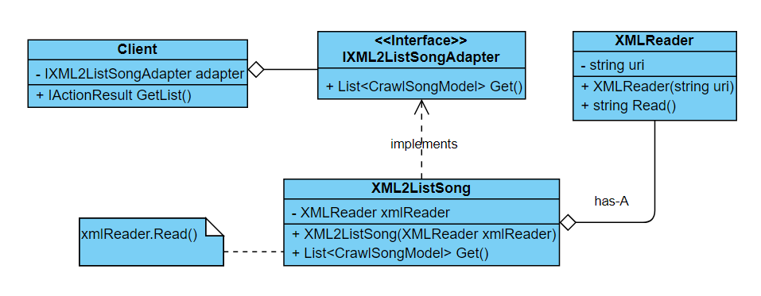

- Trong đó:
    - `IXML2ListSongAdapter`: (Super Class) là một interface định nghĩa phương thức cần thiết của Adapter
    - `XML2ListSong`: (Sub Class) là các class được implement *Super Class*, trong đó sẽ override lại phương thức cửa *super class* và chứa thuật toán xử lí dữ liệu từ xml đọc được từ `XMLReader` sang danh sách các object chứa bài hát
    - `XMLReader`: là lớp chịu trách nhiệm lấy và đọc dữ liệu crawl
    - `CrawlSongModel`: là lớp chịu trách nhiệm định nghĩa các dữ liệu cho mỗi object bài hát

### Áp dụng Adapter Pattern

- **Trước khi áp dụng**: 
    - Server khó hoặc không thể làm việc với dữ liệu crawl về ở dạng XML chứa danh sách các bài hát
    - Nếu làm việc phải sử dụng đến thư viện bên ngoài về việc xử lý xml hoặc sử dụng Regex để parse dữ liệu (khá mất thời gian) => gây ra tình trạng phản hồi chậm ở phía server
    - Nếu sử dụng ở nhiều nơi sẽ gây ra tình trạng trùng lặp code

</br>

- **Sau khi áp dụng**

<code>XMLReader.cs</code>

```cs
public class XMLReader
{
    private string uri;
    public XMLReader(string uri)
    {
        this.uri = uri;
    }
    public string Read()
    {
        return CurlHelper.Get(this.uri);
    }
}
```

<code>IXML2ListSongAdapter.cs</code>

```cs
public interface IXML2ListSongAdapter
{
    public List<CrawlSongModel> Get();
}
```

<code>CrawlSongModel.cs</code>

```cs
public class CrawlSongModel
{
    public string Name { get; set; }
    public string Artist { get; set; }
    public string Img { get; set; }
    public string Src { get; set; }
}
```

<code>XML2ListSong.cs</code>

```cs
public class XML2ListSong : IXML2ListSongAdapter
{
    private XMLReader xmlReader;
    public XML2ListSong(XMLReader xmlReader)
    {
        this.xmlReader = xmlReader;
    }
    public List<CrawlSongModel> Get()
    {
        // read xml and return json text
        XmlDocument doc = new XmlDocument();
        doc.LoadXml(this.xmlReader.Read());
        string jsonText = JsonConvert.SerializeXmlNode(doc);

        // convert json text to json object
        dynamic json = System.Text.Json.JsonDocument.Parse(jsonText);
        var j = json.RootElement.GetProperty("tracklist").GetProperty("track").EnumerateArray();
            
        //create list song
        List<CrawlSongModel> list = new();
        foreach(dynamic e in j)
        {
            list.Add(new CrawlSongModel()
            {
                Name = e.GetProperty("title").GetProperty("#cdata-section").ToString(),
                Artist = e.GetProperty("creator").GetProperty("#cdata-section").ToString(),
                Src = e.GetProperty("location").GetProperty("#cdata-section").ToString(),
                Img = e.GetProperty("coverimage").GetProperty("#cdata-section").ToString(),
            });
        }
        return list;
    }
}
```

### Testcase Adapter Pattern

- **Testcase 01:**
    - Input:
        - Base url: `https://localhost:44315/api/admin/tool/list-`
        - Params:
            - uri = `https://www.nhaccuatui.com/playlist/nhac-tre-cover-tuyen-chon-hay-nhat-hien-nay-va.W0LdkPv1T8ic.html`
    - Output:

```json
[
  {
    "name": "Đừng Quên Tên Anh (Cover)",
    "artist": "Alex Lâm",
    "img": "https://avatar-ex-swe.nixcdn.com/playlist/2022/05/12/1/d/f/4/1652329061746_500.jpg",
    "src": "https://aredir.nixcdn.com/NhacCuaTui1027/DungQuenTenAnhCover-AlexLam-7204340.mp3?st=aUpAGxn4FRkGBR_8ndLoWQ&e=1653127754"
  },
  {
    "name": "Kiếp Rong Buồn 2 (Cover)",
    "artist": "Vicky Nhung",
    "img": "https://avatar-ex-swe.nixcdn.com/playlist/2022/05/12/1/d/f/4/1652329061746_500.jpg",
    "src": "https://f9-stream.nixcdn.com/NhacCuaTui1028/KiepRongBuon2Cover-VickyNhung-7211225.mp3?st=9ULK0nrZhTIP_rtMLA8U6A&e=1653127754"
  },
  {
    "name": "Ai Chung Tình Được Mãi (Cover)",
    "artist": "Dunghoangpham",
    "img": "https://avatar-ex-swe.nixcdn.com/playlist/2022/05/12/1/d/f/4/1652329061746_500.jpg",
    "src": "https://aredir.nixcdn.com/NhacCuaTui1027/AiChungTinhDuocMaiCover-Dunghoangpham-7204342.mp3?st=AG0RxqCq-KMFQsY5MxXfmw&e=1653127754"
  },
  {
    "name": "Người Lạ Thoáng Qua (Cover)",
    "artist": "Thương Võ",
    "img": "https://avatar-ex-swe.nixcdn.com/playlist/2022/05/12/1/d/f/4/1652329061746_500.jpg",
    "src": "https://aredir.nixcdn.com/NhacCuaTui1022/NguoiLaThoangQuaCover-ThuongVo-7098732.mp3?st=SrVU74nWThoz-DV-mM7TPQ&e=1653127754"
  },
  {
    "name": "Ít Nhưng Dài Lâu (Cover)",
    "artist": "Chu Thúy Quỳnh",
    "img": "https://avatar-ex-swe.nixcdn.com/playlist/2022/05/12/1/d/f/4/1652329061746_500.jpg",
    "src": "https://f9-stream.nixcdn.com/NhacCuaTui1028/ItNhungDaiLauCover-ChuThuyQuynh-7210931.mp3?st=UQBKaZ3jLwjZjcY8SpGdmw&e=1653127754"
  },
  {
    "name": "Xem Như Tôi Chưa Từng Có Được Em (Cover)",
    "artist": "Lãnh Cung, Cường",
    "img": "https://avatar-ex-swe.nixcdn.com/playlist/2022/05/12/1/d/f/4/1652329061746_500.jpg",
    "src": "https://f9-stream.nixcdn.com/NhacCuaTui1028/XemNhuToiChuaTungCoDuocEmCover-LanhCungCuong-7210932.mp3?st=jAcMdhb1fFhyDEIH5jc_mA&e=1653127754"
  },
  {
    "name": "Ai Chung Tình Được Mãi (Cover)",
    "artist": "Thương Võ",
    "img": "https://avatar-ex-swe.nixcdn.com/playlist/2022/05/12/1/d/f/4/1652329061746_500.jpg",
    "src": "https://f9-stream.nixcdn.com/NhacCuaTui1028/AiChungTinhDuocMaiCover-ThuongVo-7211055.mp3?st=ytk_1_sNRG8Zoas_URrFFA&e=1653127754"
  },
  {
    "name": "Sắp 30 (Cover)",
    "artist": "Hương Ly",
    "img": "https://avatar-ex-swe.nixcdn.com/playlist/2022/05/12/1/d/f/4/1652329061746_500.jpg",
    "src": "https://aredir.nixcdn.com/NhacCuaTui1016/Sap30Cover-HuongLy-7024689.mp3?st=q3j2iMzJCAZSCvZd-j6cVQ&e=1653127754"
  },
  {
    "name": "Từng Thương (Cover)",
    "artist": "Đình Dũng",
    "img": "https://avatar-ex-swe.nixcdn.com/playlist/2022/05/12/1/d/f/4/1652329061746_500.jpg",
    "src": "https://f9-stream.nixcdn.com/NhacCuaTui1028/TungThuongCover-DinhDung-7211222.mp3?st=PPNPr70At3QRCXAKHEDAlA&e=1653127754"
  },
  {
    "name": "Anh Từng Cố Gắng (Cover)",
    "artist": "Hương Ly",
    "img": "https://avatar-ex-swe.nixcdn.com/playlist/2022/05/12/1/d/f/4/1652329061746_500.jpg",
    "src": "https://aredir.nixcdn.com/NhacCuaTui1014/AnhTungCoGangCover-HuongLy-6998055.mp3?st=ZN_ExT9ChmVV8TmP-mH8_Q&e=1653127754"
  },
  {
    "name": "Anh Không Tha Thứ (Cover)",
    "artist": "Thương Võ",
    "img": "https://avatar-ex-swe.nixcdn.com/playlist/2022/05/12/1/d/f/4/1652329061746_500.jpg",
    "src": "https://aredir.nixcdn.com/NhacCuaTui1012/AnhKhongThaThuCover-ThuongVo-6971239.mp3?st=ZDcuHQNxO2zTB3wzOWxXTg&e=1653127754"
  },
  {
    "name": "Không Trọn Vẹn Nữa (Cover)",
    "artist": "Thái Học",
    "img": "https://avatar-ex-swe.nixcdn.com/playlist/2022/05/12/1/d/f/4/1652329061746_500.jpg",
    "src": "https://f9-stream.nixcdn.com/NhacCuaTui1028/KhongTronVenNuaCover-ThaiHoc-7211056.mp3?st=C2JvO28Ec8LqerBJh-071w&e=1653127754"
  },
  {
    "name": "Anh Yêu Vội Thế (Cover)",
    "artist": "Nhi Nhi",
    "img": "https://avatar-ex-swe.nixcdn.com/playlist/2022/05/12/1/d/f/4/1652329061746_500.jpg",
    "src": "https://f9-stream.nixcdn.com/NhacCuaTui1028/AnhYeuVoiTheCover-NhiNhi-7211228.mp3?st=x8DN8tfs9wOlE8WWyANCaQ&e=1653127754"
  },
  {
    "name": "Hẹn Kiếp Sau (Cover)",
    "artist": "Mai Vy",
    "img": "https://avatar-ex-swe.nixcdn.com/playlist/2022/05/12/1/d/f/4/1652329061746_500.jpg",
    "src": "https://f9-stream.nixcdn.com/NhacCuaTui1028/HenKiepSauCover-MaiVy-7211229.mp3?st=QH6hzuKBlTXTvog3OQyfXw&e=1653127754"
  },
  {
    "name": "Anh Vẫn Ở Đây (Cover)",
    "artist": "Thái Học",
    "img": "https://avatar-ex-swe.nixcdn.com/playlist/2022/05/12/1/d/f/4/1652329061746_500.jpg",
    "src": "https://f9-stream.nixcdn.com/NhacCuaTui1028/AnhVanODayCover-ThaiHoc-7211057.mp3?st=c8zfFRoij7FRbQ7TTecmZA&e=1653127754"
  },
  {
    "name": "Đổi Tình Đổi Áo Đổi Anh (Cover)",
    "artist": "Thái Học",
    "img": "https://avatar-ex-swe.nixcdn.com/playlist/2022/05/12/1/d/f/4/1652329061746_500.jpg",
    "src": "https://aredir.nixcdn.com/NhacCuaTui1022/DoiTinhDoiAoDoiAnhCover-ThaiHoc-7099582.mp3?st=bTK115blDr3PSYLlu1a1HA&e=1653127754"
  },
  {
    "name": "Câu Hẹn Câu Thề (Cover)",
    "artist": "Thương Võ",
    "img": "https://avatar-ex-swe.nixcdn.com/playlist/2022/05/12/1/d/f/4/1652329061746_500.jpg",
    "src": "https://aredir.nixcdn.com/NhacCuaTui1014/CauHenCauTheCover-ThuongVo-6998296.mp3?st=I1r0sbXpu2JewgSJWpLpcg&e=1653127754"
  },
  {
    "name": "Hạnh Phúc Mới (Cover)",
    "artist": "Nhi Nhi",
    "img": "https://avatar-ex-swe.nixcdn.com/playlist/2022/05/12/1/d/f/4/1652329061746_500.jpg",
    "src": "https://f9-stream.nixcdn.com/NhacCuaTui1028/HanhPhucMoiCover-NhiNhi-7211230.mp3?st=LrUbFx3bI5q3EWgzyYkOLw&e=1653127754"
  },
  {
    "name": "Khi Nào",
    "artist": "Châu Dương",
    "img": "https://avatar-ex-swe.nixcdn.com/playlist/2022/05/12/1/d/f/4/1652329061746_500.jpg",
    "src": "https://aredir.nixcdn.com/NhacCuaTui1027/KhiNao-ChauDuong-7198871.mp3?st=GoNFN0YGjViPJqGK1N4PCQ&e=1653127754"
  },
  {
    "name": "May Mắn Khi Có Em (Cover)",
    "artist": "Trương Bảo Yến",
    "img": "https://avatar-ex-swe.nixcdn.com/playlist/2022/05/12/1/d/f/4/1652329061746_500.jpg",
    "src": "https://aredir.nixcdn.com/NhacCuaTui1027/MayManKhiCoEmCover-TruongBaoYen-7205542.mp3?st=FYABeWW2ajwGes4YSmH0GQ&e=1653127754"
  }
]
```

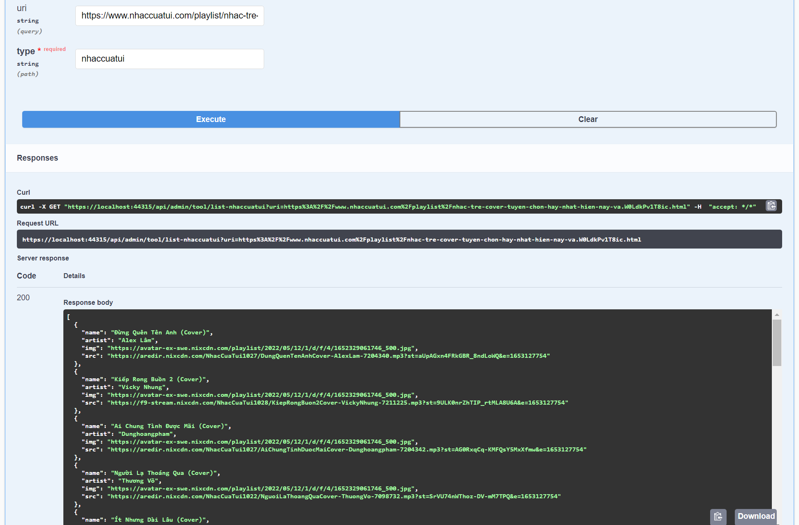

</br>

## Singleton Pattern

### Giới thiệu Singleton Pattern

>Singleton Pattern là một pattern thuộc nhóm Khởi tạo (Creational Design Pattern).Singleton đảm bảo chỉ duy nhất một thể hiện (instance) được tạo ra và nó sẽ cung cấp cho bạn một method để có thể truy xuất được thể hiện duy nhất đó mọi lúc mọi nơi trong chương trình.

### Lý do áp dụng Singleton Pattern

- Trường hợp áp dụng:
    - Áp dụng vào việc lưu trữ tạm thời một danh sách các bài hát đã crawl được
    - Áp dụng vào việc lưu trữ tạm thời các token dùng để reset mật khẩu cho user
    - Áp dụng vào việc khởi tạo server cho SocketIO
- Lý do áp dụng:
    - Áp dụng vào việc lưu trữ tạm thời một danh sách các bài hát đã crawl được
        - Một bài hát crawl được nếu chưa muốn lưu ngay sẽ lưu tạm thời
        - Chỉ lưu tạm thời nên sẽ không cần tồn tại xuyên suốt, chỉ tồn tại đến khi server dược khởi động lại
        - Một bài hát crawl có thể crawl lại nên không cân lưu vĩnh viễn
        - Chỉ một danh sách các bài hát được tạo ra trong khoảng thời gian server hoạt động để lưu trữ các bài hát crawl được
    - Áp dụng vào việc lưu trữ tạm thời các token dùng để reset mật khẩu cho user
        - User lấy lại mật khẩu sẽ được sinh ra một token
        - Token chỉ tồn tại trong 5 phút và sau đó không còn dùng được nữa
        - Người dùng chỉ sử dụng token được 1 lần duy nhất cho việc reset mật khẩu sau đó sẽ xóa
        - Nếu người dùng không sử dụng sẽ tự động loại bỏ token die ở một thời điểm nào đó (restart server)
        - Khi server hoạt động chỉ cần tạo ra một danh sách chứa các token được tạo ra
    - Áp dụng vào việc khởi tạo server cho SocketIO
        - SocketIO server chỉ khởi tạo một lần trong suốt quá trình server hoặt động
        - Nếu khởi tạo quá nhiều server trong quá trình hoạt động sẽ gây ra hiện tượng quá tải cũng như trùng port trên server
- Ưu điểm sau khi áp dụng
    - Tới ưu code (rút ngắn code) nếu sử dụng ở nhiều nơi
    - Chỉ khởi tạo một danh sách duy nhất để lưu trữ dữ liệu trong suốt thời gian server chạy
    - Giảm tải cho database
    - Tự động clear khi khởi động lại server

### Mô tả việc áp dụng Singleton Pattern

- Class diagram:

`TempCrawlSongSingleton`

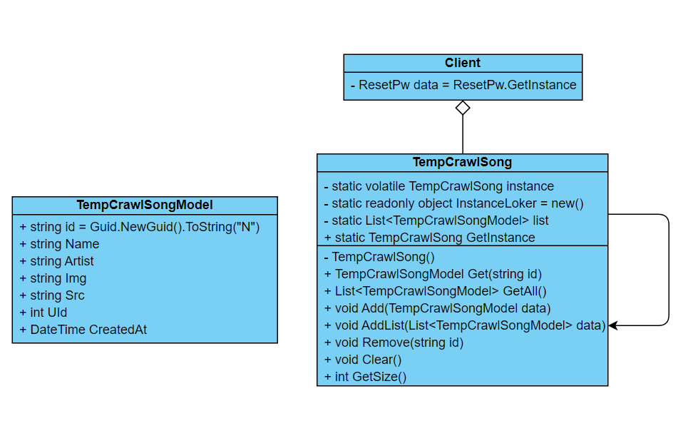

`ResetPwSingleton`

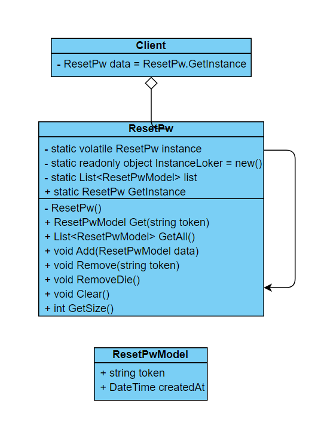

`SocketSingleton`

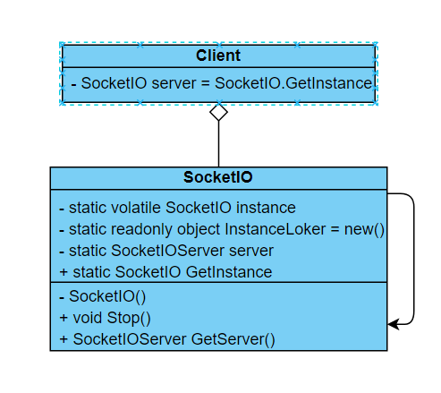

- Trong đó:
    - `TempCrawlSongSingleton`: Danh sách lưu bài hát crawl tạm
        - `TempCrawlSongModel`: là lớp chịu trách nhiệm định nghĩa các dữ liệu cho mỗi object
        - `TempCrawlSong`: Là lớp chứa việc khởi tạo singleton và các phương thức làm việc với list được tạo
    - `ResetPwSingleton`: Danh sách lưu bài hát crawl tạm
        - `ResetPwModel`: là lớp chịu trách nhiệm định nghĩa các dữ liệu cho mỗi object
        - `ResetPw`: Là lớp chứa việc khởi tạo singleton và các phương thức làm việc với list được tạo
    - `SocketSingleton`: Lưu server SocketIO
        - `SocketIO`: Là lớp chứa việc khởi tạo singleton và các phương thức làm việc với server được tạo

### Áp dụng Singleton Pattern

- **Trước khi áp dụng**: 
    - Phải sử dụng database cho việc lưu trữ các dữ liệu tạm
    - Hoặc tạo một class cho việc lưu trữ nhưng không tối ưu vì có thể người phát triển dự án sau này sẽ không biết và new lại trong quá trình code
    - Có thể gặp rắc rối trong việc khởi tạo quá nhiều class (class yêu cầu chỉ khởi tạo một lần)

</br>

- **Sau khi áp dụng**

<code>TempCrawlSongSingleton > TempCrawlSongModel.cs</code>

```cs
public class TempCrawlSongModel
{
    public string id  { get; set; } = Guid.NewGuid().ToString("N");
    public string Name { get; set; }
    public string Artist { get; set; }
    public string Img { get; set; }
    public string Src { get; set; }
    public string UName { get; set; }
    public int UId { get; set; }
    public DateTime CreatedAt { get; set; }
}
```

<code>TempCrawlSongSingleton > TempCrawlSong.cs</code>

```cs
public class TempCrawlSong
{
    private static volatile TempCrawlSong instance;
    private static readonly object InstanceLoker = new();  
    public static List<TempCrawlSongModel> list;
    private TempCrawlSong()
    {
        list = new();
    }
    public static TempCrawlSong GetInstance
    {
        get
        {
            if(instance == null)
            {
                lock (InstanceLoker)
                {
                    if(instance == null)
                    {
                        instance = new TempCrawlSong();
                    }
                }
            }
            return instance;
        }
    }
    public TempCrawlSongModel Get(string id)
    {
        var item = (from r in list
                    where r.id.Equals(id)
                    select r).FirstOrDefault();
        return item;
    }
    public List<TempCrawlSongModel> GetAll()
    {
        return list;
    }
    public void Add(TempCrawlSongModel data)
    {
        list.Add(data);
    }
    public void AddList(List<TempCrawlSongModel> data)
    {
        list.AddRange(data);
    }
    public void Remove(string id)
    {
        var item = (from r in list
                   where r.id.Equals(id)
                select r).FirstOrDefault();
        list.Remove(item);
    }
    public void Clear()
    {
        list.Clear();
    }
    public int GetSize()
    {
        return list.Count();
    }
}
```

<code>ResetPwSingleton > ResetPwModel.cs</code>

```cs
public class ResetPwModel
{
    public string token { get; set; }
    public DateTime createdAt { get; set; }
}
```

<code>ResetPwSingleton > ResetPw.cs</code>

```cs
public class ResetPw
{
    private static volatile ResetPw instance;
    private static readonly object InstanceLoker = new();
    public static List<ResetPwModel> list;
    private ResetPw()
    {
        list = new();
    }
    public static ResetPw GetInstance
    {
        get
        {
            if (instance == null)
            {
                lock (InstanceLoker)
                {
                    if (instance == null)
                    {
                        instance = new ResetPw();
                    }
                }
            }
            return instance;
        }
    }
    public ResetPwModel Get(string token)
    {
        var item = (from r in list
                    where r.token.Equals(token)
                    select r).FirstOrDefault();
        return item;
    }
    public List<ResetPwModel> GetAll()
    {
        return list;
    }
    public void Add(ResetPwModel data)
    {
        list.Add(data);
    }
    public void Remove(string token)
    {
        var item = (from r in list
                    where r.token.Equals(token)
                    select r).FirstOrDefault();
        list.Remove(item);
    }
    public void RemoveDie()
    {
        list.RemoveAll(x => x.createdAt < DateTime.Now.Date.AddHours(-1));
    }
    public void Clear()
    {
        list.Clear();
    }
    public int GetSize()
    {
        return list.Count();
    }
}
```

code>SocketSingleton > SocketIO.cs</code>

```cs
public class SocketIO
{
    private static volatile SocketIO instance;
    private static readonly object InstanceLoker = new();
    private static SocketIOServer server;
    private SocketIO()
    {
        server = new SocketIOServer(new SocketIOServerOption(9001));
        server.Start();
    }
    public static SocketIO GetInstance
    {
        get
        {
            if (instance == null)
            {
                lock (InstanceLoker)
                {
                    if (instance == null)
                    {
                        instance = new SocketIO();
                    }
                }
            }
            return instance;
        }
    }
    public void Stop()
    {
        server.Stop();
    }
    public SocketIOServer GetServer()
    {
        return server;
    }
}
```

### Testcase Singleton Pattern

- **Testcase 01:** 
    - Input: Save a song 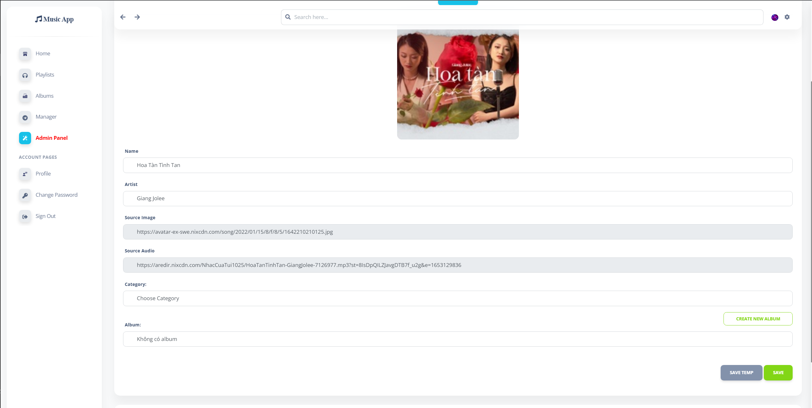
    - Output: Go to `http://localhost:3000/admin/temp-crawl` 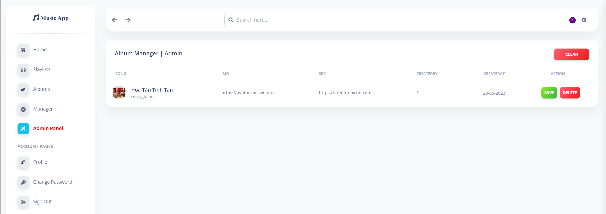

- **Testcase 02:** 
    - Input: Restart server
    - Output: Go to `http://localhost:3000/admin/temp-crawl` 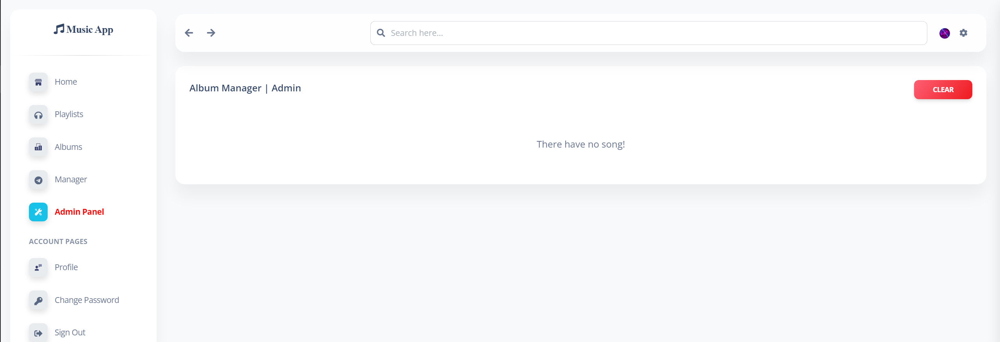

- **Testcase 03:** 
    - Input: Send a reset request 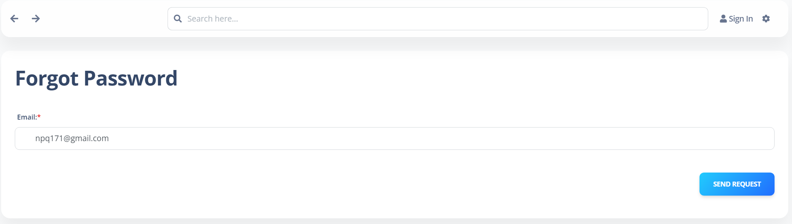
    - Output: 
        - 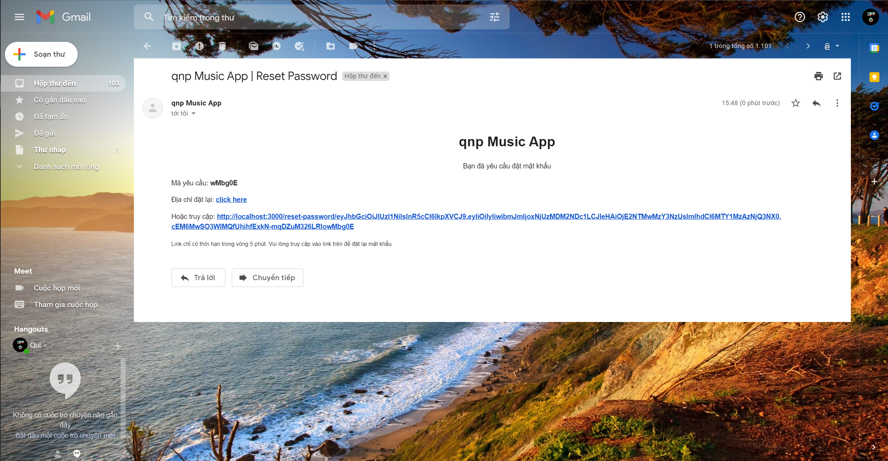
        - Go to link from email 

- **Testcase 04:** 
    - Input: Change password with success
    - Output: Go to link from email 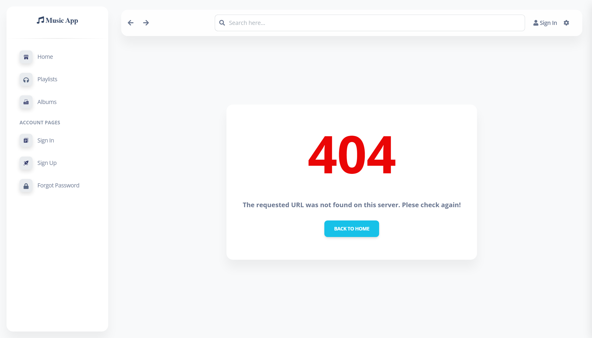

</br>

## MVC Pattern

### Giới thiệu MVC Pattern

>Model – View – Controller (MVC) Pattern là một mẫu thiết kế nhằm mục tiêu chia tách phần giao diện và code để dễ quản lý, phát triển và bảo trì. MVC Pattern  là một dạng Architectural Design Pattern được áp dụng để xử lý các vấn đề liên quan đến kiến trúc ứng dụng. MVC Pattern tuân thủ nguyên tắc thiết kế Separation of Concern, giúp phân tách logic của các tầng (layer) khác nhau trong một chương trình thành các đơn vị độc lập.

### Lý do áp dụng MVC Pattern

- Trường hợp áp dụng: áp dụng vào cấu trúc toàn dự án ngay từ đầu
- Lý do áp dụng:
    - Ứng dụng có giao tiếp với cơ sở dữ liệu (model)
    - Ứng dụng có giao diện tương tác (view)
    - Ứng dụng có sử dụng các api đễ trao đổi dữ liệu (controller)
    - Ứng dụng sẽ được tào từ từng thành phần riêng rẽ giao tiếp với nhau
    - Sử dụng ngôn ngữ coding khác nhau để tạo các thành phần bên trong dự án
- Ưu điểm sau khi áp dụng
    - Tới ưu code, phát triển ứng dụng nhanh chóng
    - Có thể sử dụng nhiều ngôn ngữ coding khác nhau cho các thành phần trong dự án
    - Các phương thức sử dụng sẽ dễ dàng lưu dữ liệu hơn vì kiểu dữ liệu quen thuộc với server
    - Giảm độ phức tạp của code
    - Giảm bớt sự phụ thuộc trong code, dễ bảo trì, dễ nâng cấp hơn
    - Giúp có thể mở rộng thành mô hình microservices hoặc microfrontend trong tương lai nếu dự án phát triển lớn

### Mô tả việc áp dụng MVC Pattern

- Diagram:

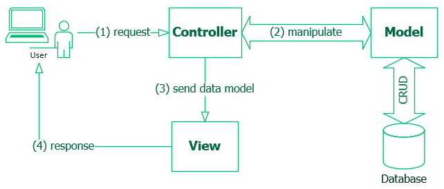

- Trong đó:
    - `Controller`: là server gồm các api tiếp nhận yêu cầu từ client gửi lên cũng như trả dữ liệu về lại cho client
    - `Model`: là các class được thiết kế để giao tiếp với cơ sở dữ liệu
    - `View`: là phần sẽ hiển thị lên cho người dùng và người dùng có thể tương tác
    - `Database`: là nơi lưu trữ dữ liệu của hệ thống

### Áp dụng MVC Pattern

- **Trước khi áp dụng**: 
    - Cả ba thành phần của MVC được thiết kế chung toàn bộ
    - Một ví dụ bằng PHP về gom chung cả ba thành phần:

```php
<?php
    require_once '../config/head.php';
    if(!isset($_SESSION['user'])){
        die ("<script>location.href='$home/';</script>");
    }
    if($permission !=2){
        die ("<script>location.href='$home/';</script>");
    }
    echo '<title>Admin | Card</title>';
    if ($permission==2){
?>
<div class="container">
    <div class="card m-auto">
        <div class="card-header text-center text-primary bg-white">
            <h1 class="font-weight-bold">CARD</h1>
        </div>
        <div class="card-body">
            <p class="text-center">
                <button class="btn btn-success" type="button" data-toggle="collapse" data-target="#themthecao" aria-expanded="false" aria-controls="themthecao">
                        Thêm thẻ nạp
                </button>
            </p>
            <div class="collapse" id="themthecao">
                <div class="card card-body">
                    <form method="POST">
                    <div class="input-group form-group">
                        <select name="menhgia" class="btn btn-light">
                            <option  selected disabled hidden>Mệnh giá</option>
                            <option value="10000">10,000</option>
                            <option value="20000">20,000</option>
                            <option value="50000">50,000</option>
                            <option value="100000">100,000</option>
                            <option value="200000">200,000</option>
                            <option value="500000">500,000</option>
                            <option value="1000000">1,000,000</option>
                            <option value="2000000">2,000,000</option>
                            <option value="5000000">5,000,000</option>
                            <option value="10000000">10,000,000</option>
                            <option value="50000000">50,000,000</option>
                        </select>
                        <input name="soluong" type="number" class="form-control" placeholder="Số lượng" min="1">
                    </div>
                    <div class="invalid-login text-warning text-center font-weight-bold">
                    </div>
                    <div class="form-group">
                        <div id="forgot-recovery-err" class="d-none alert alert-danger">Error</div>
                        <button name="themthecao" type="submit" class="btn float-right login_btn bg-primary text-white">Thêm</button>
                    </div>
                </form>
                </div>
           </div>
            <?php
                if (isset($_POST['themthecao'])){
                    $menhgia = $_POST['menhgia'];
                    $soluong = $_POST['soluong'];
                    if($menhgia == "" || $menhgia == 0 || $soluong == "" || $soluong == 0){
                        ?><div class="alert alert-danger">Có lỗi!</div><?php
                    }else{
                        for ($i=0;$i<$soluong;$i++){
                            do{
                                $mathe = substr(md5(uniqid()), 0, 12);
                                $query = mysqli_query($conn, "SELECT * FROM card WHERE mathe='$mathe'");
                            }while(mysqli_num_rows($query)>0);
                            $query = mysqli_query($conn, "INSERT INTO card(mathe,menhgia) VALUES ('$mathe',$menhgia)");
                        }
                        ?><div class="alert alert-success">Thêm thành công!</div><?php
                    }
                }
            ?>
            <h4 class="text-info">Danh sách thẻ nạp</h4>
            <table class="table text-center">
                <thead>
                    <th>STT</th>
                    <th>Mã thẻ</th>
                    <th>Mệnh giá</th>
                    <th>Date</th>
                </thead>
                <?php 
                    $total_records = mysqli_num_rows(mysqli_query($conn, "SELECT * FROM card"));
                    $current_page = isset($_GET['page']) ? $_GET['page'] : 1;
                    $limit = 10;
                    $total_page = ceil($total_records / $limit);
                    if ($current_page > $total_page){
                        $current_page = $total_page;
                    }
                    else if ($current_page < 1){
                        $current_page = 1;
                    }
                    $start = ($current_page - 1) * $limit;
                    
                    $count = 0;
                    $query = mysqli_query($conn, "SELECT * FROM card ORDER BY date DESC LIMIT $start, $limit");
                    while ($data = mysqli_fetch_assoc($query)){
                        $count++;
                ?>
                <tbody>
                    <td><?=$count?></td>
                    <td><?=$data['mathe']?></td>
                    <td><?=$data['menhgia']?></td>
                    <td><?=$data['date']?></td>
                </tbody>
                <?php
                    }
                ?>
            </table>
            <div class="d-flex justify-content-end mt-2">
            <?php
            echo "<ul class='pagination'>";
            if ($current_page > 1 && $total_page > 1){
                echo '<li class="page-item"><a class="page-link" href="?page='.($current_page-1).'">Prev</a></li>';
            }
            for ($i = 1; $i <= $total_page; $i++){
                if ($i == $current_page){
                    echo '<li class="page-item active"><a class="page-link">'.$i.'</a></li>';
                }
                else{
                    echo '<li class="page-item"><a class="page-link" href="?page='.$i.'">'.$i.'</a></li>';
                }
            }
            if ($current_page < $total_page && $total_page > 1){
                echo '<li class="page-item"><a class="page-link" href="?page='.($current_page+1).'">Next</a></li>';
            }
            echo '</ul>';
            ?>
            </div>
        </div>
    </div>
</div>
<?php
    }
    require_once '../config/end.php';
?>
```

</br>

- **Sau khi áp dụng**

<code>Controller</code>

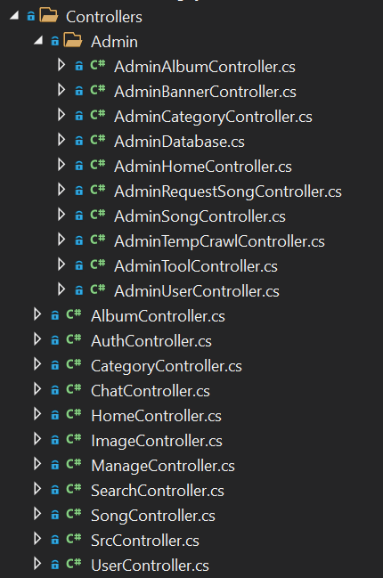

<code>Model</code>

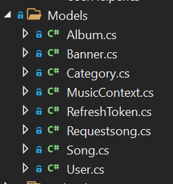

<code>View</code>

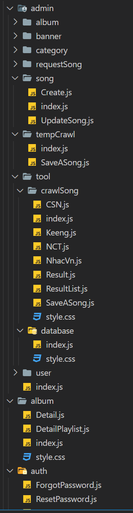

### Testcase MVC Pattern

- **Testcase 01:**
    - Description: 
        - Truy cập vào view 'Home' ở client
        - Client gửi request lên controller của server
        - Server sử dụng Model để truy cập database lấy dữ liệu
        - Server trả dữ liệu về cho client
        - Client render dữ liệu ra màn hình
    - Input:
        - Base url: `http://localhost:3000`
    - Output: 

</br>

## Observer Pattern

### Giới thiệu Observer Pattern

>Observer Pattern là một trong những Pattern thuộc nhóm hành vi (Behavior Pattern). Nó định nghĩa mối phụ thuộc một – nhiều giữa các đối tượng để khi mà một đối tượng có sự thay đổi trạng thái, tất các thành phần phụ thuộc của nó sẽ được thông báo và cập nhật một cách tự động.

### Lý do áp dụng Observer Pattern

- Trường hợp áp dụng: áp dụng vào tính năng trò chuyện thời gian thực (realtime chatting) và thông báo thời gian thực khi có một yêu cầu duyệt bài hát mới cho admin
- Lý do áp dụng:
    - Tính năng trò chuyện thời gian thực cần phản hồi và xuất hiện tin nhắn ngay khi có người dùng sử dụng tính năng trò chuyện
    - Admin xóa hết trò chuyện cần cập nhật ngay ở cả phía người dùng và admin đang sử dụng tính năng trò chuyện
    - Khi người dùng yêu cầu một bài hát mới, admin cần ngay lập tức nhận được một thông báo xuất hiện là có một yêu cầu mới vừa được gửi lên
- Ưu điểm sau khi áp dụng
    - Cập nhật trò chuyện theo thời gian thực
    - Có thể dễ dàng mở rộng thêm một số tính năng cần áp dụng thời gian thực trong dự án tương lai
    - Một đối tượng có thể thông báo đến một số lượng không giới hạn các đối tượng khác.


### Mô tả việc áp dụng Observer Pattern

- Class diagram:

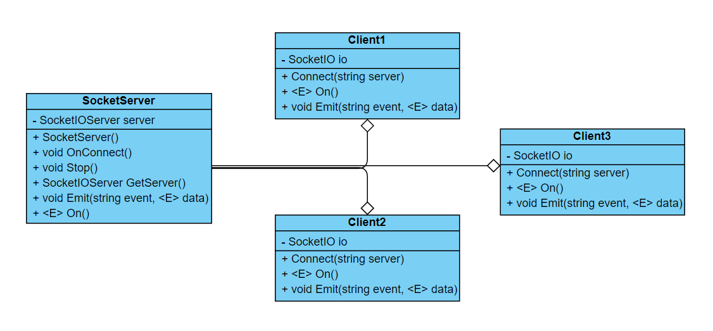

- Trong đó:
    - `SocketServer`: là class chứa hàm khởi tạo server cũng như các phương thức tiếp nhận kết nối của client, gửi dữ liệu update đến các client và tiếp nhận dữ liệu liên tục
    - `Client1`, `Client2`, `Client3`: là các client chứa phương thức kết nối đến server cũng như các sự kiện gửi dữ liệu và đón nhận dữ liệu khi giao tiếp với server

### Áp dụng Observer Pattern

- **Trước khi áp dụng**: 
    - Không thể giao tiếp liên tục giữa client và server
    - Không thể khởi tạo được các tính năng liên quan đến thời gian thực (cần được tự động cập nhật liên tục)

</br>

- **Sau khi áp dụng**

<code>SocketServer</code>

```cs
public class SocketIO
{
    private static volatile SocketIO instance;
    private static readonly object InstanceLoker = new();
    private static SocketIOServer server;
    private SocketIO()
    {
        server = new SocketIOServer(new SocketIOServerOption(9001));
        server.Start();
    }
    public static SocketIO GetInstance
    {
        get
        {
            if (instance == null)
            {
                lock (InstanceLoker)
                {
                    if (instance == null)
                    {
                           instance = new SocketIO();
                    }
                }
            }
            return instance;
        }
    }
    public void OnConnect(){
        server.OnConnection((SocketIOSocket socket) =>
        {
            System.Diagnostics.Debug.WriteLine("a client connected");
        });
    }
    public void Stop()
    {
        server.Stop();
    }
    public SocketIOServer GetServer()
    {
        return server;
    }
}
```

<code>Server > ChatController.cs</code>

```cs
public IActionResult Create([FromBody] ChatCreateModel data)
{
    if(data == null)
    {
        return Ok(new
        {
            success = false,
            message = "Input data",
        });
    }
    if (data.msg == null || data.msg.Trim().Length == 0)
    {
        return Ok(new
        {
            success = false,
            message = "Input message",
        });
    }
    int uid = User.Identity.GetId();
    var user = (from r in context.Users
                where r.Id == uid
                select r).FirstOrDefault();
    var save = new ChatModel()
    {
        id = Guid.NewGuid().ToString("N"),
        uid = user.Id,
        name = user.Name,
        avatar = user.Avatar,
        localAvatar = user.LocalAvatar,
        msg = data.msg,
    };
    db.GetList().Add(save);
    // sẻver gửi dữ liệu chat mới về cho mọi client đã kết nối
    socket.GetServer().Emit("chatAdd", save);
    return Ok(new
    {
        success = true,
        message = "Success!",
        data = save,
    });
}
```

<code>Client > Notification</code> 

```js
// kết nối đến server
const socket = io(process.env.REACT_APP_API_ENDPOINT_SOCKET)
// cài đặt đón nhận sự kiện có yêu cầu bài hát mới
socket.on('newRequest', res => {
    toast.dismiss()
    toast.warning('Have a new song request!')
})
```

<code>Client > Realtime Chatting</code>

```js
// cài đặt đón nhận sự kiện có chat mới
socket.on('chatAdd', res => {
    setData(prev => ([
         ...prev,
        res
    ]))
    ulRef.current.scrollTop = ulRef.current.scrollHeight
})
// cài đặt đón nhận sự kiện clear chat
socket.on('chatClear', () => {
    setData([])
    ulRef.current.scrollTop = ulRef.current.scrollHeight
})
```

### Testcase Observer Pattern

- **Testcase 01:**
    - Input: 
        - Truy cập vào view 'Home' ở client với hai tài khoản, trình duyệt khác nhau
        - Bắt đầu sử dụng tính năng realtime chatting
    - Output: 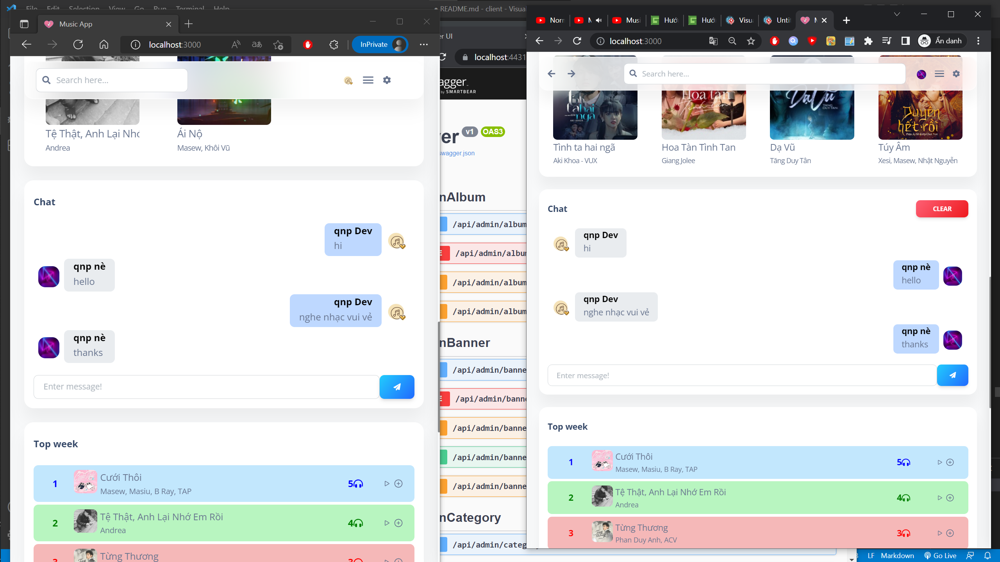

- **Testcase 02:**
    - Input: 
        - Truy cập vào view 'Home' ở client với tài khoản admin
        - Truy cập vào view 'Manage' ở client với tài khoản user và gửi một yêu cầu xét duyệt bài hát
        - 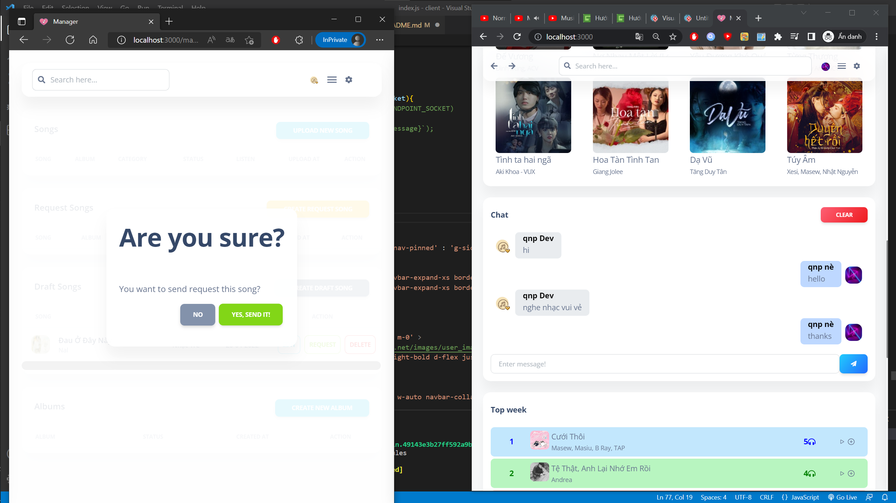
    - Output: 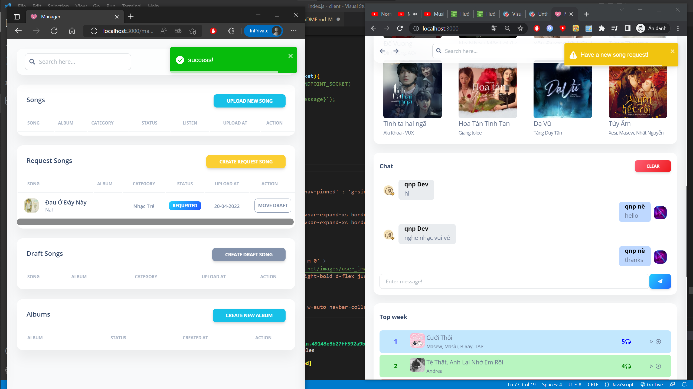
    
</br>


# 5. Some Pictures

`Home`


`Home mobile`
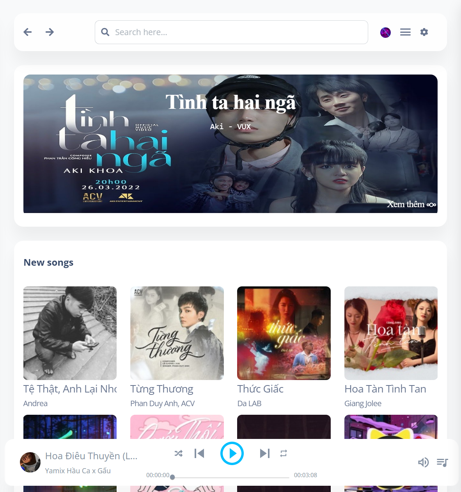

`Player control`


`Config some interface`


`Profile`
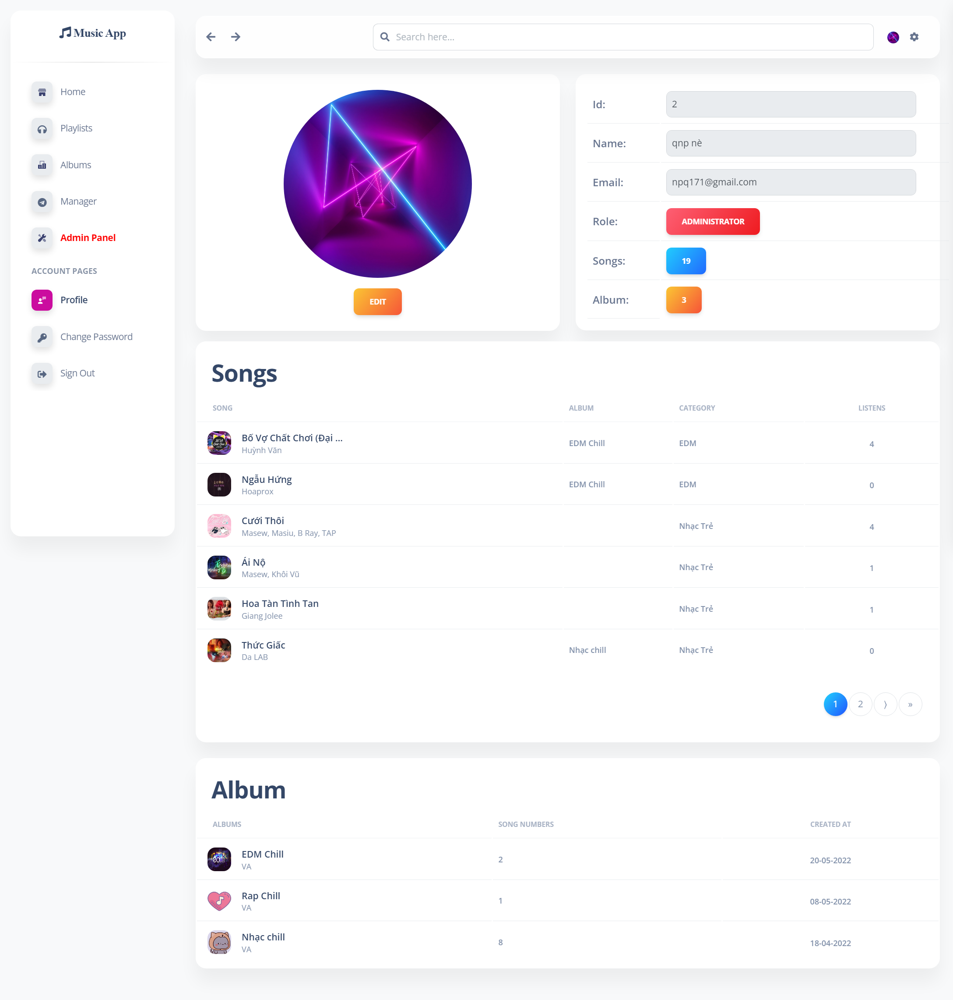

`Song lists`
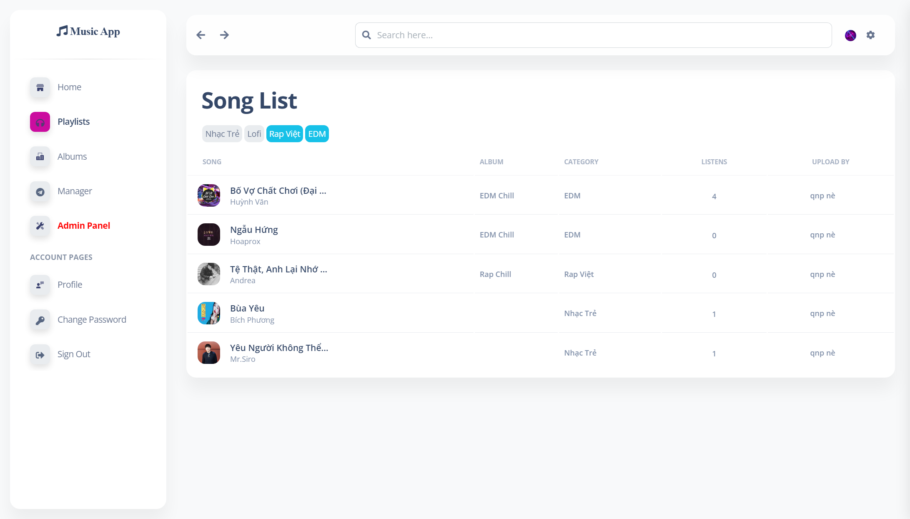

`Album`
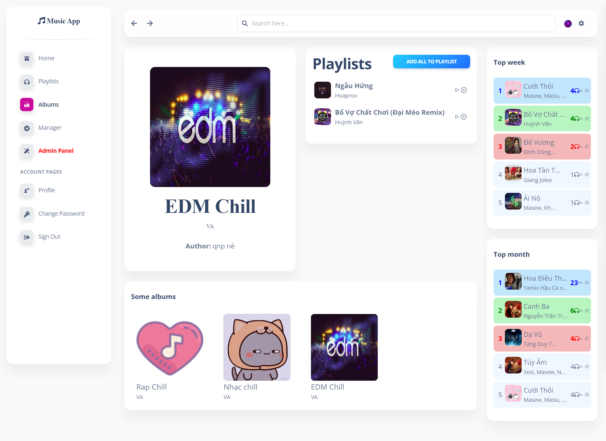

`Song`
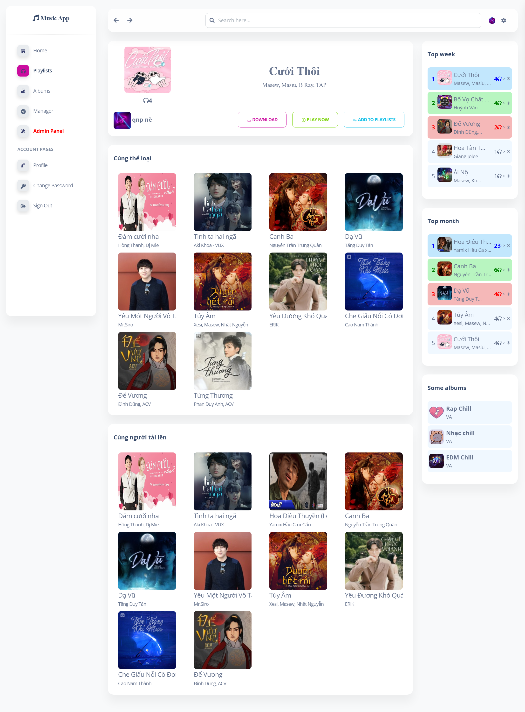

`Manage`


`Admin panel`


`Find songs and albums`


`Admin crawl nct song`
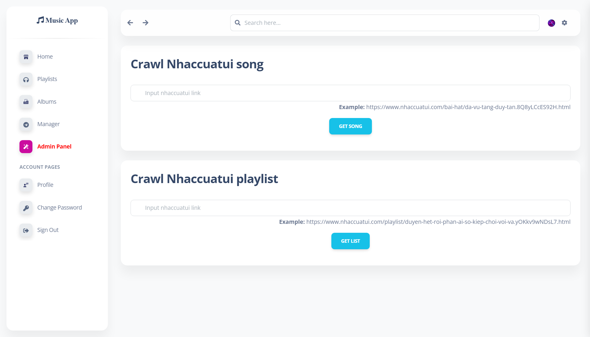

`Admin crawl nct song - review`


`Mail reset password`


`Database backup`


<h5 align="center">__qnp__</h5>
<h2 align="center">Thank you!</h3>