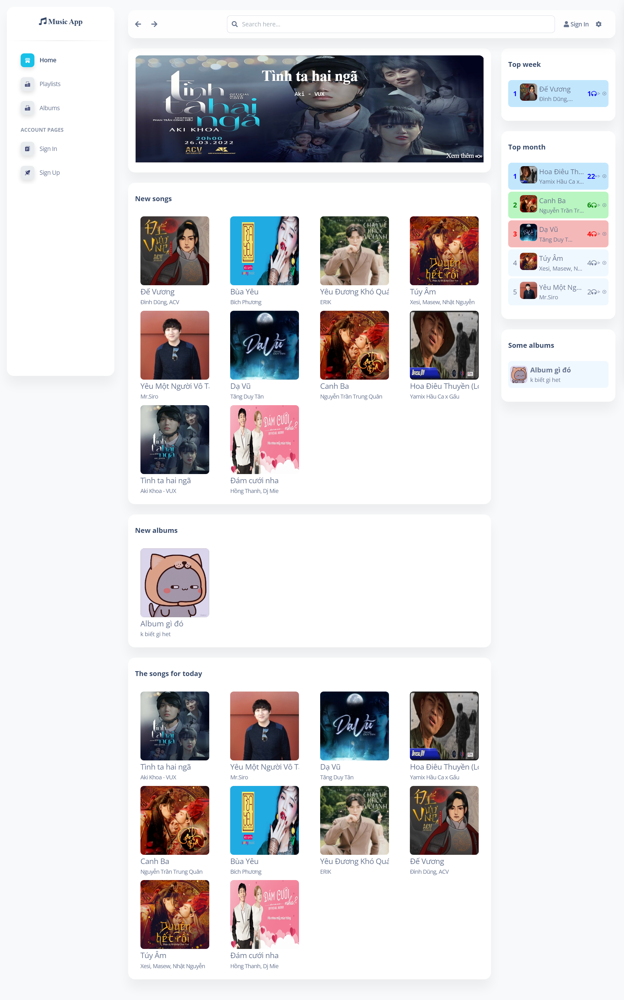
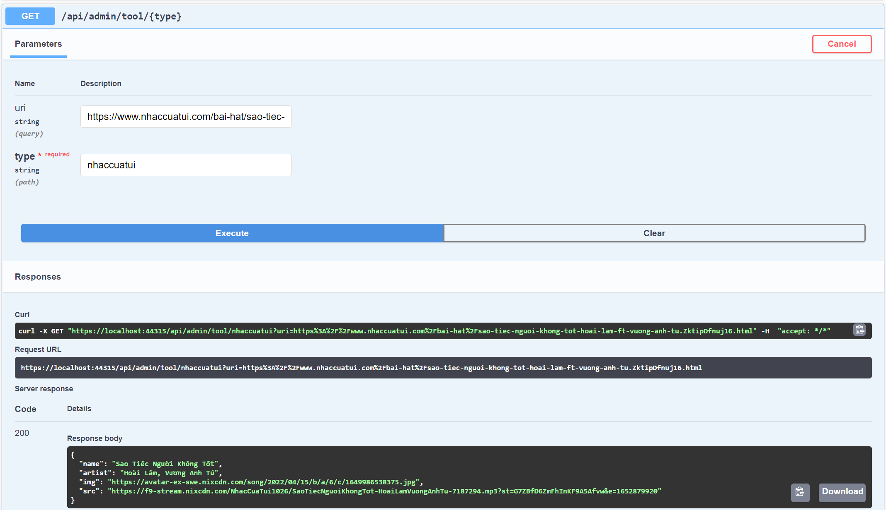
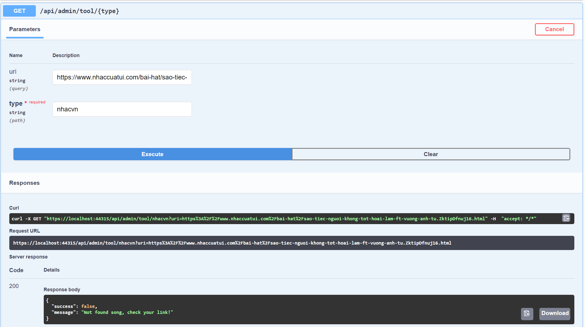
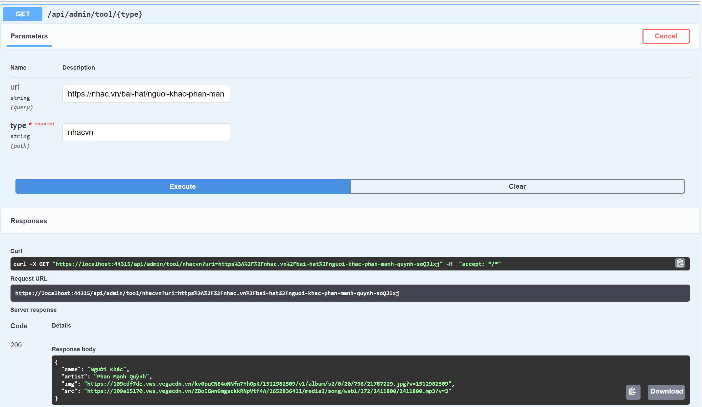
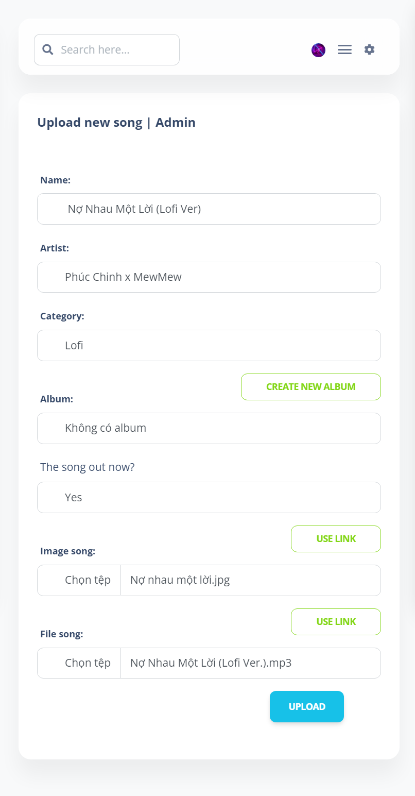
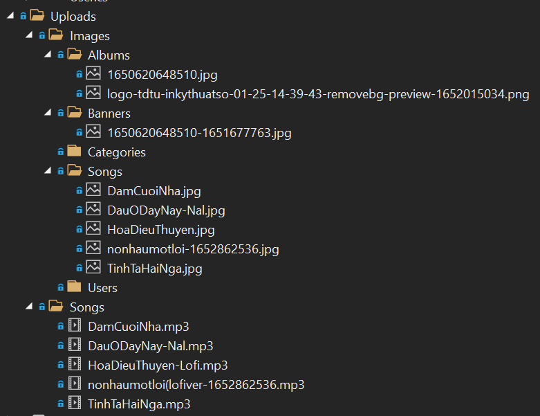

<div align="center">
    
    <h1><b>MusicApp</b></h1>
    <h5>Music App is a web application that everyone can access to find and listen to music online. Moreover, people can upload their song and download their favorite song.</br>***</h5>
    </br>
</div>

# Table of contents

1. [About](#1-about)</br>
2. [Requirements](#2-requirements)</br>
3. [Install](#3-install)</br>
4. [Design Pattern](#4-design-pattern)</br>
    4.1 [Factory Method Pattern](#factory-method-pattern)</br>
    - [Giới thiệu](#giới-thiệu-factory-method-pattern)
    - [Lý do áp dụng](#lý-do-áp-dụng-factory-method-pattern)
    - [Mô tả việc áp dụng](#mô-tả-việc-áp-dụng-factory-method-pattern)
    - [Áp dụng](#áp-dụng-factory-method-pattern)
    - [Testcase](#testcase-factory-method-pattern)

    4.2 [Template Method Pattern](#template-method-pattern)</br>
    - [Giới thiệu](#giới-thiệu-template-method-pattern)
    - [Lý do áp dụng](#lý-do-áp-dụng-template-method-pattern)
    - [Mô tả việc áp dụng](#mô-tả-việc-áp-dụng-template-method-pattern)
    - [Áp dụng](#áp-dụng-template-method-pattern)
    - [Testcase](#testcase-template-method-pattern)
    

</br>

# 1. About


</br>

**Author**

<ul>
    <li>Nguyễn Phú Quí - 51900192</li>
    <li>Nguyễn Quốc Thái - 51900210</li>
</ul>

**Technicality**

<ul>
    <li>Languages: <code>DOT.NET CORE RESTful API Server + ReactJS Client</code></li>
    <li>Database: <code>MySQL</code></li>
</ul>

**Features:**

- Users:
    - Signin and signup account
    - Reset and change account password
    - Change account infomation
    - Upload new songs
    - Create song drafts
    - Create new albums
    - Manage songs, drafts, albums
        - Hide/Show
        - Update
        - Delete
    - Listen songs
    - Download a song
    - Add songs to playlist
    - Control music player
- Administrator:
    - Confirm song requests
    - Refuse song requests
    - Create
        - New albums
        - New category
        - New songs
        - New banners
    - Update / Delete
        - Song requests
        - Songs
        - Albums
        - Categories
        - Banners
        - Users
    - Hide / Show
        - Songs
        - Albums
        - Categories
        - Banners
    - Crawl songs from other website
        - nhaccuatui.com
        - nhac.vn
        - chiasenhac.vn
        - keeng.vn

# 2. Requirements

<ul>
<li>DOT.NET CORE</li>
<li>ReactJS</li>
<li>MySQL Server</li>
</ul>

# 3. Install

<ul>
<li>Clone the repository with git clone </li>
<li>Run <code>SQLQuery.sql</code> database in MySQL</li>
<li>Config server database in <code>server/server/Models/MusicContext.cs</code> file</li>
<li>Open 'server' folder in <code>Visual Studio</code> and run it</li>
<li>Run client with <code>npm start</code> in client folder</li>
<li>Your demo is available at <code>localhost:3000</code></li>
</ul>

# 4. Design Pattern

## Factory Method Pattern

### Giới thiệu Factory Method Pattern

>Factory Method Pattern là một mẫu thiết kế thuộc nhóm khởi tạo (creational design pattern) cung cấp một giao diện để tạo các đối tượng trong lớp cha, nhưng cho phép các lớp con thay đổi loại đối tượng sẽ được tạo. Giúp cho việc khởi tạo đổi tượng một cách linh hoạt hơn.

### Lý do áp dụng Factory Method Pattern

- Trường hợp áp dụng: áp dụng vào việc crawl nhạc từ các trang bên ngoài như nhaccuatui, keeng,... ở phía server
- Lý do áp dụng:
    - Việc crawl nhạc từ các trang khác nhau nhaccuatui, keeng
    - Thuật toán xử lý việc crawl dữ liệu nhạc khác nhau ở mỗi trang
    - Đều trả về chung một kết quả là dữ liệu một bài hát crawl được
    - Đều nhận vào một url là đường dẫn đến bài hát đó
- Ưu điểm sau khi áp dụng
    - Tối ưu code (rút gọn code)
    - Có thể dễ dàng mở rộng tool crawl cho nhiều trang web khác nhau
    - Dễ dàng bảo trì cũng như chỉnh sửa hoạt động của tool khi trang web crawl thay đổi cấu trúc dữ liệu

### Mô tả việc áp dụng Factory Method Pattern

- `ICrawSong`: (Super Class) là một interface định nghĩa phương thức cần thiết của Factory
- `CrawlNhaccuatui`, `CrawlKeeng`, `CrawlNhacVn`, `CrawlChiasenhac`: (Sub Class) là các class được implement *Super Class*, trong đó sẽ override lại phương thức cửa *super class* và chứa thuật toán crawl nhạc
- `CrawlSòngactory`: là lớp chịu trách nhiệm khởi tạo các *sub class* dựa trên đầu vào

### Áp dụng Factory Method Pattern

- **Trước khi áp dụng**

<code>AdminToolController.cs</code>

```cs
[HttpGet("{type}")]
public IActionResult GetSong(string uri, string type)
{
    if(uri == null || type == null || uri.Trim().Length == 0 || type.Trim().Length == 0)
    {
        return BadRequest(new
        {
            success = false,
            message = "Enter link or type!",
        });
    }

    try
    {
        if(type.Equals("nhaccuatui")){
            var curl = CurlHelper.Get(uri);
            var matchs = Regex.Matches(curl, "xmlURL = \"(.+?)\";");
            var link = matchs[0].Groups[1].Value;
            curl = CurlHelper.Get(link);
            matchs = Regex.Matches(curl, @"<!\[CDATA\[(.+?)]]>");
            string name = matchs[0].Groups[1].Value;
            string artist = matchs[2].Groups[1].Value;
            string src = matchs[3].Groups[1].Value;
            matchs = Regex.Matches(curl, @"<avatar><!\[CDATA\[(.+?)]]>");
            string img = matchs[0].Groups[1].Value;
            return Ok(new CrawlSongModel()
            {
                Name = name,
                Artist = artist,
                Src = src,
                Img = img,
            });
        }else if(type.Equals("nhacvn")){
                var curl = CurlHelper.Get(uri);
                var matchs = Regex.Matches(curl, "sources: \\[\\{\"file\":\"(.+?)\",");
                var src = matchs[0].Groups[1].Value.Replace("\\", "");
                matchs = Regex.Matches(curl, "title:'(.+?)',");
                var name = matchs[0].Groups[1].Value;
                matchs = Regex.Matches(curl, "thumb : '(.+?)',");
                var img = matchs[0].Groups[1].Value;
                matchs = Regex.Matches(curl, "description:'(.+?)',");
                var artist = matchs[0].Groups[1].Value;
                return Ok(new CrawlSongModel()
                {
                    Name = name,
                    Artist = artist,
                    Src = src,
                    Img = img,
                });
        }else{
            return BadRequest(new
            {
                success = false,
                message = "Type can not found!"
            });
        }
    }
    catch (Exception)
    {
        return BadRequest(new
        {
            success = false,
            message = "Not found song, check your link!"
        });
    }
}
```

</br>

- **Sau khi áp dụng**

<code>AdminToolController.cs</code>

```cs
[HttpGet("{type}")]
public IActionResult GetSong(string uri, string type)
{
    if(uri == null || type == null || uri.Trim().Length == 0 || type.Trim().Length == 0)
    {
        return BadRequest(new
        {
            success = false,
            message = "Enter link or type!",
        });
    }

    try
    {
        ICrawlSong crawl = CrawlSongFactory.GetCrawlSong(type);
        return Ok(crawl.GetData(uri));
    }
    catch (Exception)
    {
        return BadRequest(new
        {
            success = false,
            message = "Not found song, check your link!"
        });
    }
}
```

<code>ICrawlSong.cs</code>

```cs
public interface ICrawlSong
{
    public CrawlSongModel GetData(string uri);
}
```

<code>CrawlSongFactory.cs</code>

```cs
public class CrawlSongFactory
{
    private CrawlSongFactory() { }
    public static ICrawlSong GetCrawlSong(string crawlSongType)
    {
        switch (crawlSongType.Trim().ToLower())
        {
            case "nhaccuatui":
                return new CrawlNhaccuatui();
            case "nhacvn":
                return new CrawlNhacVn();
            case "chiasenhac":
                return new CrawlChiasenhac();
            case "keeng":
                return new CrawlKeeng();
            default:
                throw new ArgumentException("This type is unsupported");
        }
    }
}
```

<code>CrawlNhaccuatui.cs</code>

```cs
public class CrawlNhaccuatui : ICrawlSong
{
    public CrawlSongModel GetData(string uri)
    {
        try
        {
            var curl = CurlHelper.Get(uri);
            var matchs = Regex.Matches(curl, "xmlURL = \"(.+?)\";");
            var link = matchs[0].Groups[1].Value;
            curl = CurlHelper.Get(link);
            matchs = Regex.Matches(curl, @"<!\[CDATA\[(.+?)]]>");
            string name = matchs[0].Groups[1].Value;
            string artist = matchs[2].Groups[1].Value;
            string src = matchs[3].Groups[1].Value;
            matchs = Regex.Matches(curl, @"<avatar><!\[CDATA\[(.+?)]]>");
            string img = matchs[0].Groups[1].Value;
            return new CrawlSongModel()
            {
                Name = name,
                Artist = artist,
                Src = src,
                Img = img,
            };
        }
        catch
        {
            throw new Exception();
        }
    }
}
```

<code>CrawlNhacVn.cs</code>

```cs
public class CrawlNhacVn : ICrawlSong
{
    public CrawlSongModel GetData(string uri)
    {
        try
        {
            var curl = CurlHelper.Get(uri);
            var matchs = Regex.Matches(curl, "sources: \\[\\{\"file\":\"(.+?)\",");
            var src = matchs[0].Groups[1].Value.Replace("\\", "");
            matchs = Regex.Matches(curl, "title:'(.+?)',");
            var name = matchs[0].Groups[1].Value;
            matchs = Regex.Matches(curl, "thumb : '(.+?)',");
            var img = matchs[0].Groups[1].Value;
            matchs = Regex.Matches(curl, "description:'(.+?)',");
            var artist = matchs[0].Groups[1].Value;
            return new CrawlSongModel()
            {
                Name = name,
                Artist = artist,
                Src = src,
                Img = img,
            };
        }
        catch
        {
            throw new Exception();
        }
    }
}
```

### Testcase Factory Method Pattern

- **Testcase 01:**
    - Input:
        - Base url: `https://localhost:44315/api/admin/tool/`
        - Params:
            - uri = `https://www.nhaccuatui.com/bai-hat/sao-tiec-nguoi-khong-tot-hoai-lam-ft-vuong-anh-tu.ZktipDfnuj16.html`
            - type = `nhaccuatui`
    - Output:

```json
{
  "name": "Sao Tiếc Người Không Tốt",
  "artist": "Hoài Lâm, Vương Anh Tú",
  "img": "https://avatar-ex-swe.nixcdn.com/song/2022/04/15/b/a/6/c/1649986538375.jpg",
  "src": "https://f9-stream.nixcdn.com/NhacCuaTui1026/SaoTiecNguoiKhongTot-HoaiLamVuongAnhTu-7187294.mp3?st=7hMjDHu0CSn53lkSbWSvHQ&e=1652879061"
}
```



- **Testcase 02:**
    - Input:
        - Base url: `https://localhost:44315/api/admin/tool/`
        - Params:
            - uri = `https://www.nhaccuatui.com/bai-hat/sao-tiec-nguoi-khong-tot-hoai-lam-ft-vuong-anh-tu.ZktipDfnuj16.html`
            - type = `nhacvn`
    - Output:

```json
{
  "success": false,
  "message": "Not found song, check your link!"
}
```



- **Testcase 03:**
    - Input:
        - Base url: `https://localhost:44315/api/admin/tool/`
        - Params:
            - uri = `https://nhac.vn/bai-hat/nguoi-khac-phan-manh-quynh-soQJlxj`
            - type = `nhacvn`
    - Output:

```json
{
  "name": "Người Khác",
  "artist": "Phan Mạnh Quỳnh",
  "img": "https://109cdf7de.vws.vegacdn.vn/kv0puCNE4oNNfn7YhOpK/1512982509/v1/album/s2/0/20/796/21787229.jpg?v=1512982509",
  "src": "https://109a15170.vws.vegacdn.vn/ZBoIGwn6mgsckkRNpVtf4A/1652836411/media2/song/web1/172/1411800/1411800.mp3?v=3"
}
```



</br>

## Template Method Pattern

### Giới thiệu Template Method Pattern

>Template Method Pattern là một mẫu thiết kế thuộc nhóm hành vi (behavioral design pattern) có chức năng xác định khung của một thuật toán trong lớp cha nhưng cho phép các lớp con ghi đè các bước cụ thể của thuật toán mà không thay đổi cấu trúc của nó.

### Lý do áp dụng Template Method Pattern

- Trường hợp áp dụng: áp dụng vào việc lưu file upload ở phía server
- Lý do áp dụng:
    - File upload có nhiều dạng file nên được chia ra các thư mục lưu khác nhau
    - Các bước lưu file giống nhau
    - Việc lưu file có các thuật toán chung chỉ khác ở đường dẫn lưu với các file khác nhau
    - Đều trả về chung một kết quả là tên hoặc đường dẫn file đã lưu trên server
    - Đều nhận vào một file
- Ưu điểm sau khi áp dụng
    - Tối ưu code (rút gọn code)
    - Có thể dễ dàng thay đổi thuật toán lưu file
    - Dễ dàng bảo trì cũng như chỉnh sửa đường dẫn lưu file mà không cần quan tâm đã sử dụng ở dâu (chỉnh một lần, apply cho tất cả)
    - Không cần ghi nhớ đường dẫn lưu file mối khi sử dụng. Hạn chế lỗi về sai sót trong đường dẫn lưu file

### Mô tả việc áp dụng Template Method Pattern

- `UploadTemplate`: (Abtract Class) là một abtract định nghĩa phương thức cần thiết, các thuật toán chung và các bước thực hiện thuật toán
- `UploadImageSong`, `UploadImageAlbum`, `UploadImageBanner`, `UploadImageCategory`, `UploadImageUser`, `UploadSong`: (Sub Class) là các class được extends *Abtract Class*, trong đó sẽ viết các thuật toán cho các phương thức abtract cửa *super class*

### Áp dụng Template Method Pattern

- **Trước khi áp dụng**

<code>AdminSongController.cs</code> > <code>CreateSong()</code>

```cs
[HttpPost("create"), DisableRequestSizeLimit]
public async Task<IActionResult> CreateSong()
{
    var createBy = User.Identity.GetId();
    try
    {
        // ...Some code get data... //
                
        if (localImg == 1 && localSrc == 0)
        {

            var folderName = Path.Combine("Uploads", "Images", "Songs");

            var pathToSave = Path.Combine(Directory.GetCurrentDirectory(), folderName);
            var fileName = SongHelper.ConvertSongFile(ContentDispositionHeaderValue.Parse(files[0].ContentDisposition).FileName.Trim('"'));
            var fullPath = Path.Combine(pathToSave, fileName);
            using (var stream = new FileStream(fullPath, FileMode.Create))
            {
                files[0].CopyTo(stream);
            }

            src = formCollection["src"][0].ToString().Trim();
            image = fileName;
        }
        if (localImg == 0 && localSrc == 1)
        {
            var folderName = Path.Combine("Uploads", "Songs");

            var pathToSave = Path.Combine(Directory.GetCurrentDirectory(), folderName);
            var fileName = SongHelper.ConvertSongFile(ContentDispositionHeaderValue.Parse(files[0].ContentDisposition).FileName.Trim('"'));
            var fullPath = Path.Combine(pathToSave, fileName);
            using (var stream = new FileStream(fullPath, FileMode.Create))
            {
                files[0].CopyTo(stream);
            }
            image = formCollection["img"][0].ToString().Trim();
            src = fileName;
        }
        if (localImg == 1 && localSrc == 1)
        {
            var folderName = Path.Combine("Uploads", "Songs");

            var pathToSave = Path.Combine(Directory.GetCurrentDirectory(), folderName);
            var fileName = SongHelper.ConvertSongFile(ContentDispositionHeaderValue.Parse(files[0].ContentDisposition).FileName.Trim('"'));
            var fullPath = Path.Combine(pathToSave, fileName);
            using (var stream = new FileStream(fullPath, FileMode.Create))
            {
                files[0].CopyTo(stream);
            }
            src = fileName;

            folderName = Path.Combine("Uploads", "Images", "Songs");

            pathToSave = Path.Combine(Directory.GetCurrentDirectory(), folderName);
            fileName = SongHelper.ConvertSongFile(ContentDispositionHeaderValue.Parse(files[1].ContentDisposition).FileName.Trim('"'));
            fullPath = Path.Combine(pathToSave, fileName);
            using (var stream = new FileStream(fullPath, FileMode.Create))
            {
                files[1].CopyTo(stream);
            }

            image = fileName;
        }
        if(localImg == 0 && localSrc == 0)
        {
            image = formCollection["img"][0].ToString().Trim();
            src = formCollection["src"][0].ToString().Trim();
        }

        // ...some code create and return data... //
                  
    }
    catch (Exception e)
    {
        return StatusCode(500, "Internal server error " + e);
    }
}
```

</br>

- **Sau khi áp dụng**

<code>AdminSongController.cs</code> > <code>CreateSong()</code>

```cs
[HttpPost("create"), DisableRequestSizeLimit]
public async Task<IActionResult> CreateSong()
{
    var createBy = User.Identity.GetId();
    try
    {
        // ...Some code get data... //
                
        UploadTemplate upload;
        if (localImg == 1 && localSrc == 0)
        {
            src = formCollection["src"][0].ToString().Trim();
            upload = new UploadImageSong();
            image = upload.UploadFile(files[0]);
        }
        if (localImg == 0 && localSrc == 1)
        {
            image = formCollection["img"][0].ToString().Trim();
            upload = new UploadSong();
            src = upload.UploadFile(files[0]);
        }
        if (localImg == 1 && localSrc == 1)
        {
            upload = new UploadImageSong();
            image = upload.UploadFile(files[0]);
            upload = new UploadSong();
            src = upload.UploadFile(files[1]);
        }
        if(localImg == 0 && localSrc == 0)
        {
            image = formCollection["img"][0].ToString().Trim();
            src = formCollection["src"][0].ToString().Trim();
        }

        // ...some code create and return data... //
                  
    }
    catch (Exception e)
    {
        return StatusCode(500, "Internal server error " + e);
    }
}
```

<code>UploadTemplate.cs</code>

```cs
public abstract class UploadTemplate
{
    protected abstract string FolderName();
    protected string SaveFile(IFormFile file, string folderName)
    {
        var pathToSave = Path.Combine(Directory.GetCurrentDirectory(), folderName);
        var fileName = SongHelper.ConvertSongFile(ContentDispositionHeaderValue.Parse(file.ContentDisposition).FileName.Trim('"'));
        var fullPath = Path.Combine(pathToSave, fileName);
        using (var stream = new FileStream(fullPath, FileMode.Create))
        {
            file.CopyTo(stream);
        }
        return fileName;
    }
    public string UploadFile(IFormFile file)
    {
        string folderName = FolderName();
        string fileName = SaveFile(file, folderName);
        return fileName;  
    }
}
```

<code>UploadSong.cs</code>

```cs
public class UploadSong : UploadTemplate
{
    protected override string FolderName()
    {
        return Path.Combine("Uploads", "Songs");
    }
}
```

<code>UploadImageSong.cs</code>

```cs
public class UploadImageSong : UploadTemplate
{
    protected override string FolderName()
    {
        return Path.Combine("Uploads", "Images", "Songs");
    }
}
```

<code>UploadImageBanner.cs</code>

```cs
public class UploadImageBanner : UploadTemplate
{
    protected override string FolderName()
    {
        return Path.Combine("Uploads", "Images", "Banners");
    }
}
```

>Các file `UploadImageAlbum.cd`, `UploadImageCategory.cs`, `UploadImageUser.cs` tương tự các file trên chỉ thay đổi giá trị trả về

### Testcase Template Method Pattern

- **Testcase 01:**
    - Input:
        - Url: `https://localhost:44315/api/admin/tool/`
        - Params:
            
    - Output:
        
    - Result
        


<h5 align="center">__qnp__</h5>
<h2 align="center">Good luck!</h3>